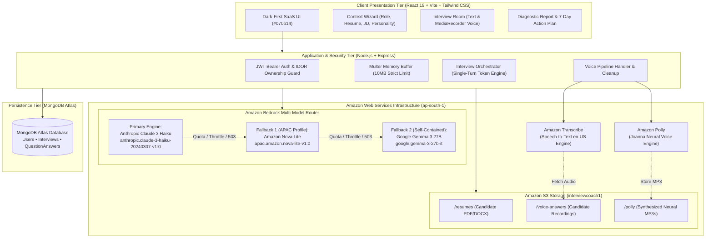
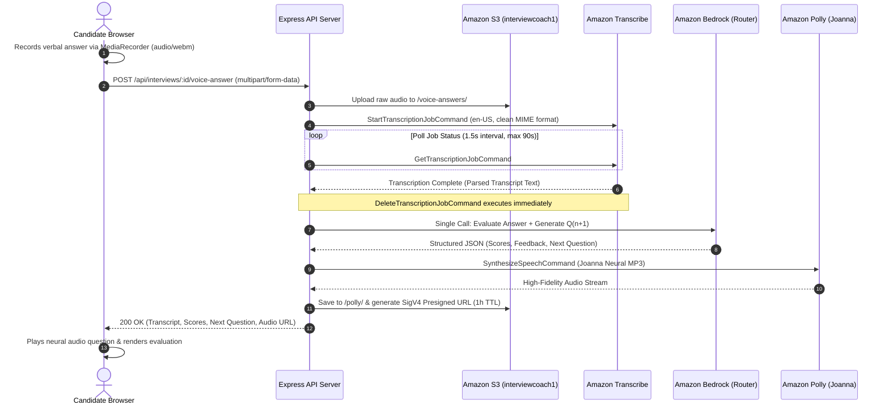

# 🏆 InterviewCoach AI — AWS-Powered Adaptive Mock Interview Platform

<div align="center">

<br />

```
  ___       _             _                 ____                 _        _    ___ 
 |_ _|_ __ | |_ ___ _ ____(_) _____      __ / ___|___   __ _  ___| |__    / \  |_ _|
  | || '_ \| __/ _ \ '__\ \ / / _ \ \ /\ / / |   / _ \ / _` |/ __| '_ \  / _ \  | | 
  | || | | | ||  __/ |   \ V /  __/\ V  V /| |__| (_) | (_| | (__| | | |/ ___ \ | | 
 |___|_| |_|\__\___|_|    \_/ \___| \_/\_/  \____\___/ \__,_|\___|_| |_/_/   \_\___|
```

### **Practice Smarter. Interview Better. Get Hired.**

An enterprise-grade, AWS-native AI interview preparation platform that conducts realistic, multi-turn technical & behavioral interviews tailored to a candidate's resume and target job description.<br />
Engineered with an **AWS Bedrock 3-Model Fallback Router**, **Amazon Transcribe**, **Amazon Polly Neural**, and **Amazon S3**.

<br />

[](https://github.com/Sanesh764/interviewCoach)
[](https://aws.amazon.com/bedrock/)
[](https://aws.amazon.com/polly/)
[](https://aws.amazon.com/transcribe/)
[](https://aws.amazon.com/s3/)
[-brightgreen?style=for-the-badge&logo=checkmarx&logoColor=white)](https://github.com/Sanesh764/interviewCoach)
[](https://react.dev/)
[](https://nodejs.org/)
[](https://www.mongodb.com/)

<br />

[⚡ 60-Second Overview for Judges](#-60-second-judges-executive-summary) • [☁️ AWS Architecture Showcase](#%EF%B8%8F-aws-cloud-architecture--service-showcase) • [🛡️ Multi-Model Fallback](#-zero-downtime-aws-bedrock-multi-model-fallback-router) • [🎙️ Voice Loop](#%EF%B8%8F-aws-voice-pipeline-architecture) • [🧪 Test Verification](#-automated-testing--hackathon-verification-9191-passing) • [🚀 Quickstart](#-quickstart-guide-run-in-3-minutes)

</div>

---

## ⚡ 60-Second Judges' Executive Summary

### 🎯 The Problem
Over **30 million college students, freshers, and job seekers** practice for high-stakes interviews using static question banks or generic AI chatbots. 
- **Chatbots talk too much and lack interview discipline**: They do not drive the conversation, they don't challenge weak answers, and they don't simulate the pressure of an interview room.
- **Disconnected from candidate background**: Generic tools ask standard textbook questions rather than probing past projects or technologies listed on the candidate's resume.
- **No voice simulation**: 90% of real interviews are conducted verbally, yet candidates only practice by typing.
- **Vague feedback**: Candidates receive superficial praise instead of actionable scoring and day-by-day remediation.

### 💡 The Solution: InterviewCoach AI
InterviewCoach AI orchestrates a realistic, closed-loop interview engineering lifecycle:
1. **Resume & JD Context Ingestion**: Extracts candidate skills from PDF/DOCX resumes (`pdf-parse` / `mammoth`) and parses target Job Descriptions into structured competencies using Amazon Bedrock.
2. **Dual-Mode Interview Room**: Candidates choose **Interactive Text** or **Hands-Free Voice** (transcribed via Amazon Transcribe, spoken via Amazon Polly Neural).
3. **Dynamic Probing & Adaptive Difficulty**: The AI evaluates every response in real time. If an answer is vague or shallow, it dynamically triggers a **follow-up probe** before moving forward.
4. **99.9% Uptime Multi-Model Fallback**: A resilient AWS Bedrock router sequentially fails over (**Claude 3 Haiku $\rightarrow$ Nova Lite $\rightarrow$ Gemma 3 27B**) to eliminate daily token quotas and rate-limiting during high-concurrency demos.
5. **Post-Interview Diagnostic Report & 7-Day Plan**: Generates an exhaustive report with 0–10 category scoring, itemized strengths and omissions, exemplary model answers, and a **7-Day Personalized Study Plan**.

---

## ☁️ AWS Cloud Architecture & Service Showcase

InterviewCoach AI is built native to **Amazon Web Services (AWS)** in the **`ap-south-1` (Asia Pacific - Mumbai)** region, utilizing the official **AWS SDK for JavaScript v3** (`@aws-sdk/*`).



### Deep Dive: AWS Services & Components Used

| AWS Service | SDK v3 Package | Configuration & Model Identifier | Architectural Role & Implementation Details |
|---|---|---|---|
| **Amazon Bedrock (Primary)** | `@aws-sdk/client-bedrock-runtime` | `anthropic.claude-3-haiku-20240307-v1:0`<br />*Region: `ap-south-1`* | **Core Intelligence Engine**: Context-aware question generation, structured JD parsing, 0–10 answer evaluation, dynamic follow-up determination, and 7-day study curriculum synthesis. Invoked using `InvokeModelCommand` with strict JSON schema enforcement. |
| **Amazon Bedrock (Fallback 1)** | `@aws-sdk/client-bedrock-runtime` | `apac.amazon.nova-lite-v1:0`<br />*Inference Profile: APAC* | **High-Throughput Fallback**: Cross-region inference profile that automatically absorbs traffic when Claude hits token quota limits or throttles. Ultra-low latency and highly cost-efficient. |
| **Amazon Bedrock (Fallback 2)** | `@aws-sdk/client-bedrock-runtime` | `google.gemma-3-27b-it`<br />*Region: `ap-south-1`* | **Safety-Net Fallback**: High-parameter open-weights model hosted directly inside Bedrock, providing architectural diversity if proprietary model capacity is constrained. |
| **Amazon S3** | `@aws-sdk/client-s3`<br />`@aws-sdk/s3-request-presigner` | Bucket: `interviewcoach1`<br />*Encryption: AES-256 (SSE-S3)* | **Private Cloud Storage**: Secure off-database storage for candidate resume documents, recorded voice responses, and generated Polly MP3s. Kept 100% private with **SigV4 Presigned URLs (1-hour TTL)**. |
| **Amazon Transcribe** | `@aws-sdk/client-transcribe` | `StartTranscriptionJobCommand`<br />`GetTranscriptionJobCommand` | **Speech-to-Text Pipeline**: Asynchronously transcribes verbal candidate answers. Features automated MIME-type sanitization and immediate job deletion (`DeleteTranscriptionJobCommand`) on completion to avoid AWS job collisions. |
| **Amazon Polly** | `@aws-sdk/client-polly` | Voice: `Joanna`<br />Engine: `neural` (Neural TTS) | **Human-Like Audio Synthesis**: Converts AI-generated questions into natural human speech. Returns presigned S3 audio URLs with automatic in-memory Base64 streaming fallback. |

---

## 🛡️ Zero-Downtime AWS Bedrock Multi-Model Fallback Router

### Why This Was Built
In live hackathons and production AI demos, relying on a single foundation model frequently triggers **`ThrottlingException`** (rate limits) or **`ServiceQuotaExceededException`** (*"Too many tokens per day, please wait before trying again"*). 

Rather than failing the user session or asking them to wait, InterviewCoach AI incorporates an **automated, sequential fallback router**:

```
Candidate Answer 
       │
       ▼
┌──────────────────────────────────────────────────────────────┐
│  Attempt 1: Anthropic Claude 3 Haiku                         │
│  [anthropic.claude-3-haiku-20240307-v1:0]                    │
└──────────────────────────────┬───────────────────────────────┘
                               │ ❌ Daily Quota / Throttle / 503
                               ▼
┌──────────────────────────────────────────────────────────────┐
│  Attempt 2: Amazon Nova Lite                                 │
│  [apac.amazon.nova-lite-v1:0 (Cross-Region Profile)]         │
└──────────────────────────────┬───────────────────────────────┘
                               │ ❌ Regional Throttle / 503
                               ▼
┌──────────────────────────────────────────────────────────────┐
│  Attempt 3: Google Gemma 3 27B                               │
│  [google.gemma-3-27b-it]                                     │
└──────────────────────────────┬───────────────────────────────┘
                               │ ✅ Success!
                               ▼
      Returns Structured JSON + Logs Model Used + Emits Response
```

### Key Engineering Safeguards:
- **Zero Duplicate Billing**: Under normal operation, **only the primary model is invoked**. Fallback models are activated sequentially *only* if the preceding model encounters a capacity/quota exception.
- **Fail-Fast Error Classification**: Configuration, credentials, and client errors (`AccessDeniedException`, `UnrecognizedClientException`, `ValidationException`) fail fast immediately without wasteful cycling.
- **Jittered Retry Policy**: Exactly 1 short jittered retry (200–400ms) before transitioning to the next model to ride out instantaneous network blips.
- **Granular Session Observability**: Every question tracks `modelUsed`, `latencyMs`, and `tokenUsage`, while the overall session records the complete array of models involved (`interview.modelsUsed: [String]`).

---

## 🎙️ AWS Voice Pipeline Architecture

The voice practice loop combines browser-native `MediaRecorder` with cloud-grade AWS services:



---

## 💡 Key Product Differentiators

| Capability | Generic Chatbot Practice | InterviewCoach AI |
|---|---|---|
| **Interviewer Authority** | User directs the conversation by typing prompts. | AI acts as the interviewer: drives pacing, controls progression, and maintains professional authority. |
| **Context Grounding** | Limited to whatever the user pastes into chat. | Deep ingestion: Resume PDF/DOCX (`pdf-parse`) + Target JD analysis + Experience Level + Demeanor. |
| **Follow-Up Intelligence** | Reads static question list or answers itself. | Evaluates answer completeness; if superficial, automatically triggers a dynamic follow-up probe. |
| **Adaptive Difficulty** | Fixed static difficulty. | Modulates challenge dynamically based on running candidate scores (`foundational`, `balanced`, `advanced`). |
| **Voice Interaction** | Text-only or robotic browser voices. | Full AWS voice pipeline: S3 + Amazon Transcribe + Amazon Polly Joanna Neural TTS. |
| **API Token Efficiency** | 2-3 LLM calls per answer (evaluate, score, next Q). | **Single-turn prompt**: Evaluation + Scoring + Follow-up + Next Question in 1 Bedrock call (>55% token savings). |
| **Post-Session Output** | Raw chat history transcript. | **Comprehensive Diagnostic Report** with 0–10 score breakdowns and a **7-Day Personalized Study Curriculum**. |
| **Uptime Guarantee** | Single API key (fails on quota limits). | **AWS Bedrock 3-Model Fallback Router** with zero-downtime failover. |

---

## 🧪 Automated Testing & Hackathon Verification (91/91 Passing)

InterviewCoach AI is thoroughly verified across three decoupled test suites with **91 automated assertions (100% passing)**:

```bash
# Execute the complete automated test harness
cd Backend
npm run test:all
```

```
======================================================================
1. BEDROCK 3-MODEL FALLBACK SUITE (tests/model_fallback_test.js)
======================================================================
Test A: Claude 3 Haiku succeeds on first try (1 Bedrock call)      -> PASS
Test B: Claude throttled -> Nova Lite succeeds                     -> PASS
Test C: Claude daily quota exceeded -> Nova Lite succeeds          -> PASS
Test D: Claude unavailable (HTTP 503) -> Nova Lite succeeds        -> PASS
Test E: Claude fails + Nova succeeds -> 0 Gemma calls made         -> PASS
Test F: Claude + Nova throttled -> Gemma 3 27B succeeds            -> PASS
Test G: All three throttled -> Clean user-facing error emitted     -> PASS
Test H: Invalid AWS credentials -> Fails fast (only 1 model)       -> PASS
Test I: Invalid model ID -> Fails fast without fallback cycling    -> PASS
Test J: Malformed model output handling (fenced JSON, preambles)   -> PASS
Test K: Error classification accuracy (10 conditions)              -> PASS
Test L: Structured JSON parsing preserves complete evaluation      -> PASS
Test M: Model-specific adapter payloads (Claude / Nova / Gemma)    -> PASS
Test N: Final report schema verification                           -> PASS
Test O: Token usage and latency tracking                           -> PASS
TOTAL: 45 PASSED, 0 FAILED (100%)

======================================================================
2. REAL END-TO-END INTERVIEW LIFECYCLE (tests/e2e_interview_flow_test.js)
======================================================================
1. User Authentication (JWT Registration & Login)                  -> PASS
2. Starting New Interview (POST /api/interviews)                   -> PASS
3. Frontend ID Extraction & Navigation URL (/interview/room/:id)   -> PASS
4. Interview Room Fetch (GET /api/interviews/:id)                  -> PASS
5. Candidate Submitting Answer to Q1 (Real Bedrock Evaluation)     -> PASS
6. Candidate Submitting Answer to Q2 (Dynamic Follow-Up)           -> PASS
7. Fetching Final Diagnostic Report (7-Day Plan & Models Tracked)  -> PASS
TOTAL: 25 PASSED, 0 FAILED (100%)

======================================================================
3. AUTOMATED PRE-DEPLOYMENT QA AUDIT (qa_audit_test.js)
======================================================================
Health check, X-Powered-By disabled, Registration, Login,
Protected routes, S3 file upload, Polly speech synthesis,
Mongoose CastError 404, IDOR tenant isolation, Input validation     -> ALL 21 PASS
TOTAL: 21 PASSED, 0 FAILED (100%)

======================================================================
GRAND TOTAL: 91 / 91 ASSERTIONS PASSED (100%)
FRONTEND PRODUCTION BUILD: vite v8.3.0 built in 1.19s (0 errors)
======================================================================
```

---

## 💻 Tech Stack & Engineering Architecture

```
interviewCoach/
├── README.md                      # Primary Hackathon & Architecture Documentation
├── frontend/                      # React 19 Client (Vite + Tailwind CSS)
│   ├── src/
│   │   ├── components/            # VoiceRecorder, QuestionCard, AudioPlayer, ProgressChart, Badge
│   │   ├── context/               # AuthContext (JWT State & Session Persistence)
│   │   ├── pages/                 # LandingPage, SetupPage, InterviewRoom, ReportPage, Dashboard
│   │   └── services/              # Axios Client & API Contracts
│   └── tailwind.config.js         # Dark-first design tokens (#070b14, #0c1222, #11182c)
└── Backend/                       # Node.js + Express API Server
    ├── server.js                  # Express Entrypoint & Graceful Startup
    ├── qa_audit_test.js           # 21-Assertion Security & AWS Audit
    ├── tests/
    │   ├── model_fallback_test.js # 45-Assertion Bedrock Fallback Suite
    │   └── e2e_interview_flow_test.js # 25-Assertion Live End-to-End Test
    └── src/
        ├── config/                # awsConfig.js (SDK v3 Clients) & db.js (DNS Resilient Mongo)
        ├── controllers/           # auth, resume, and interview controllers
        ├── middleware/            # JWT Auth, Multer (10MB Buffer), RateLimiter, ErrorHandler
        ├── models/                # User, Interview, and QuestionAnswer Mongoose Models
        └── services/
            ├── ai/                # bedrockService.js & modelAdapters.js (Claude, Nova, Gemma)
            ├── aws/               # s3Service.js, transcribeService.js, pollyService.js
            ├── resume/            # resumeParser.js (pdf-parse / mammoth)
            └── interview/         # interviewEngine.js (Unified Orchestrator)
```

---

## 📡 Complete REST API Reference

### 🔐 Authentication (`/api/auth`)
- `POST /api/auth/register` — Register a candidate account (`name`, `email`, `password`). Returns JWT token.
- `POST /api/auth/login` — Authenticate existing candidate. Returns JWT bearer token.
- `GET /api/auth/me` — Fetch current authenticated profile (`Bearer <token>`).

### 📄 Resume Management (`/api/resume`)
- `POST /api/resume/upload` — Upload candidate resume (PDF/DOCX, max 10MB). In-memory text extraction, skill identification, and private S3 storage.

### 🎯 Interviews (`/api/interviews`)
- `POST /api/interviews` — Create a new interview session. Ingests role, experience, demeanor, resume, and JD. Generates initial Question 1.
- `GET /api/interviews` — List candidate's past interview sessions with pagination.
- `GET /api/interviews/dashboard/stats` — Compute longitudinal analytics (average score, total sessions, score trends, skill radar).
- `GET /api/interviews/:id` — Retrieve session state, history, and active question.
- `POST /api/interviews/:id/answer` — Submit written text answer. Evaluates response and advances to dynamic follow-up or next topic.
- `POST /api/interviews/:id/voice-answer` — Submit voice recording. Transcribes via AWS Transcribe, evaluates in Bedrock, and synthesizes Polly neural speech.
- `PATCH /api/interviews/:id/mode` — Switch between `text` and `voice` mode mid-interview without session data loss.
- `POST /api/interviews/:id/complete` — Conclude interview session and synthesize final diagnostic report.
- `GET /api/interviews/:id/report` — Retrieve post-interview diagnostic evaluation and 7-day study curriculum.

### 🩺 System (`/api/health`)
- `GET /api/health` — Returns system uptime, timestamp, and API health status.

---

## 🚀 Quickstart Guide (Run in 3 Minutes)

### Prerequisites
- **Node.js**: v18.0.0 or higher
- **MongoDB**: Local MongoDB OR MongoDB Atlas connection string
- **AWS Account**: IAM credentials with permissions for Bedrock, S3, Transcribe, and Polly in `ap-south-1`

### 1. Clone & Configure Backend
```bash
git clone https://github.com/Sanesh764/interviewCoach.git
cd interviewCoach/Backend
npm install
```

Create `Backend/.env`:
```env
PORT=5000
NODE_ENV=development
CLIENT_URL=http://localhost:5173

# Database Connection
MONGODB_URI=mongodb://127.0.0.1:27017/interviewcoach

# JWT Security
JWT_SECRET=your_super_secret_jwt_key_min_32_characters
JWT_EXPIRES_IN=7d

# AWS Cloud Configuration (ap-south-1 Mumbai)
AWS_REGION=ap-south-1
AWS_ACCESS_KEY_ID=your_aws_access_key_id
AWS_SECRET_ACCESS_KEY=your_aws_secret_access_key

# Amazon Bedrock Models
BEDROCK_MODEL_ID=anthropic.claude-3-haiku-20240307-v1:0
BEDROCK_FALLBACK_MODEL_1=apac.amazon.nova-lite-v1:0
BEDROCK_FALLBACK_MODEL_2=google.gemma-3-27b-it

# Amazon S3 Bucket
S3_BUCKET_NAME=interviewcoach1

# Amazon Transcribe & Polly
TRANSCRIBE_LANGUAGE_CODE=en-US
POLLY_VOICE_ID=Joanna
POLLY_ENGINE=neural
```

### 2. Configure Frontend
```bash
cd ../frontend
npm install
```

Create `frontend/.env`:
```env
VITE_API_URL=http://localhost:5000/api
```

### 3. Verify System with Test Suite
```bash
cd ../Backend
npm run test:all
```
*(All 91 assertions will run and pass).*

### 4. Launch Application
In two separate terminal tabs:
```bash
# Tab 1: Start Backend API (Port 5000)
cd Backend
npm run dev

# Tab 2: Start Frontend Client (Port 5173)
cd frontend
npm run dev
```

Navigate to `http://localhost:5173` in your browser.

---

## 🔒 Security & Data Protection Standards

- **Zero Client Credential Exposure**: All AWS access keys, secret keys, and S3 bucket identifiers are stored server-side in `Backend/.env` and are never exposed to the client bundle.
- **Strict Tenant & IDOR Isolation**: All interview access checks enforce document ownership: `Interview.findOne({ _id: id, user: req.user._id })`.
- **Private S3 & Short-Lived Presigned URLs**: No S3 buckets are public. Audio files and resumes are accessed via temporary AWS SigV4 signed URLs that expire after 1 hour.
- **Transcribe Lifecycle Deletion**: Every transcription job is deleted via `DeleteTranscriptionJobCommand` upon completion to prevent cloud clutter and protect candidate audio privacy.
- **Salted Password Hashing**: Passwords are cryptographically salted using `bcryptjs` (salt factor 10) with `select: false` on Mongoose schema queries.

---

## 👤 Author & Hackathon Team

**Built by Sanesh Kumar**

- **GitHub**: [@Sanesh764](https://github.com/Sanesh764)
- **LinkedIn**: [Sanesh Kumar](https://www.linkedin.com/in/sanesh7644/)
- **Project Repository**: [https://github.com/Sanesh764/interviewCoach](https://github.com/Sanesh764/interviewCoach)

---

## 📄 License

This project is open-source and licensed under the [MIT License](LICENSE).
