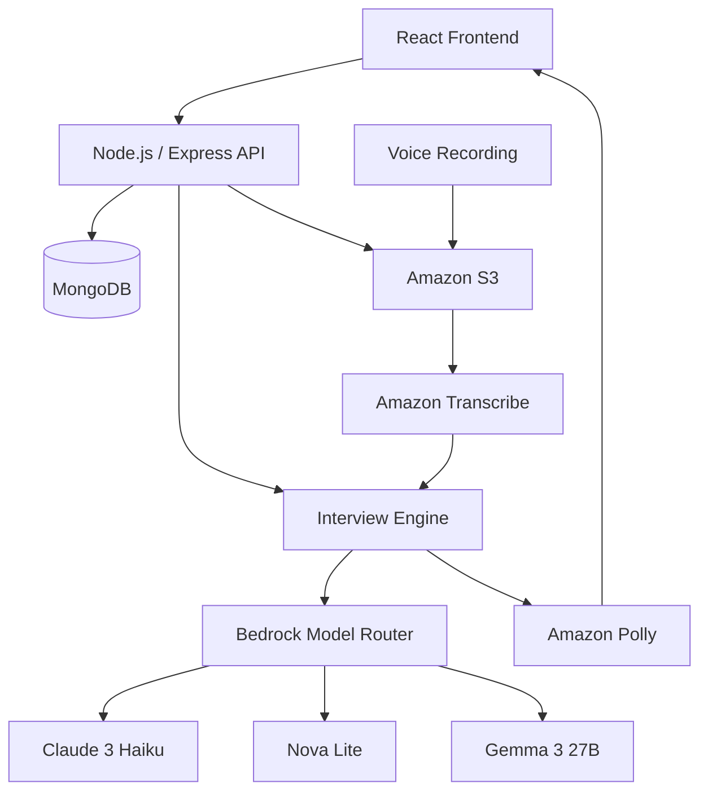

# InterviewCoach AI

> **Practice smarter. Interview better.**

InterviewCoach AI is a personal AI interviewer that helps candidates practice realistic interviews, identify their weaknesses, and improve through personalized feedback.

Built for college students, freshers, and job seekers, InterviewCoach AI replaces static question lists and generic chatbots with an adaptive, context-grounded interview workflow powered by **Amazon Web Services (AWS)**.

---

## Table of Contents

- [1. Executive Summary](#1-executive-summary)
- [2. The Problem & The Solution](#2-the-problem--the-solution)
- [3. System Architecture](#3-system-architecture)
- [4. Why AWS? Infrastructure & Service Deep Dive](#4-why-aws-infrastructure--service-deep-dive)
- [5. Amazon Bedrock Multi-Model Fallback Router](#5-amazon-bedrock-multi-model-fallback-router)
- [6. Voice Interview Pipeline](#6-voice-interview-pipeline)
- [7. Adaptive Interview Flow & Follow-Up Probing](#7-adaptive-interview-flow--follow-up-probing)
- [8. Resume & Job Description Context Grounding](#8-resume--job-description-context-grounding)
- [9. Multi-Metric Answer Evaluation](#9-multi-metric-answer-evaluation)
- [10. Post-Interview Diagnostic Report & 7-Day Plan](#10-post-interview-diagnostic-report--7-day-plan)
- [11. Technology Stack](#11-technology-stack)
- [12. Local Setup & Quickstart](#12-local-setup--quickstart)
- [13. Security & Engineering Standards](#13-security--engineering-standards)
- [14. License](#14-license)

---

## 1. Executive Summary

Most interview preparation tools rely on static, memorized question banks or unstructured chatbot conversations. In contrast, InterviewCoach AI orchestrates a closed-loop engineering cycle:

```text
Practice → Interview → Feedback → Weakness Detection → Personalized Learning Plan → Practice Again
```

Instead of asking disconnected questions, the platform:
- Ingests the candidate's actual **resume** (PDF/DOCX) and target **job description** to ask role-relevant questions.
- Dynamically decides when to ask a **probing follow-up question** if an answer is incomplete or vague.
- Modulates question complexity in real time based on **adaptive difficulty tiers** (`foundational`, `balanced`, `advanced`).
- Supports both **Text** and **Voice** modes through a unified interview engine, allowing mid-session switching.
- Incorporates a **resilient multi-model Bedrock fallback router** (Claude 3 Haiku $\rightarrow$ Nova Lite $\rightarrow$ Gemma 3 27B) to handle model quotas and transient throttling in `ap-south-1`.
- Concludes each session with an objective **diagnostic evaluation** and a **7-Day Personalized Improvement Plan**.

---

## 2. The Problem & The Solution

| Problem in Existing Preparation | How InterviewCoach AI Solves It |
|---|---|
| **Chatbots talk too much**; user drives the conversation rather than experiencing interview pressure. | **AI Interviewer drives the session**: Introduces questions, waits for answers, enforces interview cadence, and evaluates performance. |
| **Generic, ungrounded questions** that ignore candidate background. | **Resume & JD Context Ingestion**: Uses extracted projects, technologies, and JD requirements to tailor questions directly to the candidate. |
| **No verbal practice**: 90% of interviews are verbal, yet candidates practice by typing or reading. | **AWS Voice Pipeline**: Candidates speak into the browser; audio is transcribed via Amazon Transcribe and answered with Amazon Polly neural speech. |
| **Superficial praise or vague feedback** ("Good job, improve communication"). | **Structured Multi-Metric Evaluation**: 0–10 scores across technical accuracy, depth, clarity, relevance, and completeness, with exemplary model answers. |
| **No clear remediation roadmap**. | **Personalized 7-Day Curriculum**: Automatically targets candidate's identified weak areas with day-by-day learning tasks. |

---

## 3. System Architecture



### Architecture Highlights:
1. **Separation of Presentation & Business Logic**: React client interacts with the Express backend via REST endpoints protected by JWT authentication and IDOR session-ownership checks.
2. **Unified Interview Engine**: Both Text and Voice modes execute through the exact same backend engine (`interviewEngine.js`). Once voice answers are transcribed, scoring criteria, follow-up logic, and difficulty adjustments remain identical.
3. **Dedicated Cloud Storage**: Binary assets (PDF/DOCX resumes, candidate voice recordings, synthesized speech) are offloaded to Amazon S3, keeping MongoDB documents lean and query latency low.

---

## 4. Why AWS? Infrastructure & Service Deep Dive

InterviewCoach AI integrates AWS cloud services to handle compute-intensive AI, media storage, speech recognition, and speech synthesis natively in the `ap-south-1` (Asia Pacific - Mumbai) region:

| AWS Service | Official SDK Package | Role in InterviewCoach AI & Why It Was Chosen |
|---|---|---|
| **Amazon Bedrock** | `@aws-sdk/client-bedrock-runtime` | **Cognitive Intelligence & Reasoning Engine**<br />Powers JD structured analysis, dynamic question synthesis, multi-dimensional answer evaluation, follow-up decisions, and final diagnostic report generation. Chosen for managed enterprise foundation models, predictable latency, and unified API access across model providers. |
| **Amazon S3** | `@aws-sdk/client-s3`<br />`@aws-sdk/s3-request-presigner` | **Private Binary Storage & Secure Audio Streaming**<br />Stores candidate resume documents, recorded voice responses, and synthesized audio files in a private bucket (`interviewcoach1`). Playback is secured via short-lived AWS SigV4 presigned URLs (1-hour TTL) without making files publicly accessible. |
| **Amazon Transcribe** | `@aws-sdk/client-transcribe` | **Asynchronous Speech-to-Text Processing**<br />Transcribes candidate voice recordings accurately into text for the interview engine. Handled asynchronously with automated cleanup (`DeleteTranscriptionJobCommand`) on completion to avoid lingering AWS resources. |
| **Amazon Polly** | `@aws-sdk/client-polly` | **Conversational Speech Synthesis**<br />Converts AI-generated question text into natural, lifelike spoken audio using the **`Joanna` Neural** voice engine, providing a realistic auditory interview experience. |

---

## 5. Amazon Bedrock Multi-Model Fallback Router

In production AI applications, foundation models can experience rate limits (`ThrottlingException`), daily token quota exhaustion (`ServiceQuotaExceededException`), or transient availability drops (HTTP 429/503).

To mitigate this, InterviewCoach AI incorporates an **automated sequential Bedrock fallback router**:

```text
Candidate Request
       │
       ▼
┌──────────────────────────────────────────────────────────────┐
│  Bedrock Model Router                                        │
│  Region: ap-south-1                                          │
└──────────────────────────────┬───────────────────────────────┘
                               │
                               ▼
┌──────────────────────────────────────────────────────────────┐
│  Primary Model: Anthropic Claude 3 Haiku                     │
│  [anthropic.claude-3-haiku-20240307-v1:0]                    │
└──────────────────────────────┬───────────────────────────────┘
                               │ (Eligible quota / throttle / 503 error)
                               ▼
┌──────────────────────────────────────────────────────────────┐
│  Fallback Model 1: Amazon Nova Lite                          │
│  [apac.amazon.nova-lite-v1:0 (Cross-Region Profile)]         │
└──────────────────────────────┬───────────────────────────────┘
                               │ (Eligible quota / throttle / 503 error)
                               ▼
┌──────────────────────────────────────────────────────────────┐
│  Fallback Model 2: Google Gemma 3 27B                        │
│  [google.gemma-3-27b-it]                                     │
└──────────────────────────────┬───────────────────────────────┘
                               │
                               ▼
            Normalized Structured JSON Response
```

### Router Implementation Details:
- **Sequential Execution (Zero Redundant Invocations)**: Under normal conditions, **only one model is called**. Fallback models are activated sequentially *only* if the preceding model encounters an eligible capacity or quota exception.
- **Fail-Fast Error Handling**: Non-transient errors (such as `AccessDeniedException`, `UnrecognizedClientException`, `ValidationException`, or `ResourceNotFoundException`) fail fast immediately without cycling through fallback models.
- **Jittered Retry Policy**: Before transitioning to the next model, the router attempts one short jittered retry (200–400ms) to resolve instantaneous network blips.
- **Resilient 4-Tier JSON Extraction**: Bedrock responses pass through a multi-tier parser (direct parse $\rightarrow$ outer markdown fence stripping $\rightarrow$ outermost brace isolation $\rightarrow$ trailing comma cleanup) to guarantee valid JSON extraction even if the model surrounds output with commentary.
- **Granular Observability**: The interview session records every model that participated in `interview.modelsUsed: [String]`, while each question tracks its specific `modelUsed`, `latencyMs`, and token counts.

> **Note on Guarantees**: Fallback routing improves resilience against model-specific quota and temporary throttling failures, but does not claim zero cost on failed upstream requests or unconditional availability if all configured models are unavailable.

---

## 6. Voice Interview Pipeline

The voice interview workflow is designed for deterministic reliability without requiring complex or fragile WebRTC streaming connections:

```text
Browser MediaRecorder (Candidate speaks)
        ↓
Candidate clicks "Send Voice Answer" (Explicit submission)
        ↓
Node.js Express backend (Multer memory buffer, 10MB limit)
        ↓
Amazon S3 (Upload raw audio to private bucket /voice-answers)
        ↓
Amazon Transcribe (StartTranscriptionJobCommand)
        ↓
Polling loop (Checks GetTranscriptionJobCommand until COMPLETED)
        ↓
Transcript extracted + DeleteTranscriptionJobCommand (Immediate cleanup)
        ↓
Unified Interview Engine (Passed as answer text)
        ↓
Amazon Bedrock Router (Answer evaluated + Next question generated)
        ↓
Amazon Polly (SynthesizeSpeechCommand with Joanna Neural)
        ↓
S3 Presigned URL generated (with direct Base64 fallback if S3 upload fails)
        ↓
Browser receives evaluation, transcript, next question, and audio playback URL
```

### Key Voice Safeguards:
1. **Explicit Submission**: Audio recording is controlled directly by the candidate. The recording stops, can be reviewed in-browser, and is submitted explicitly—preventing premature submissions.
2. **Unified Logic**: Both Text and Voice share the identical interview state machine. Candidates can freely toggle modes mid-interview via `PATCH /api/interviews/:id/mode`.
3. **MIME Sanitization**: Sanitizes browser-specific MIME strings (e.g. `audio/webm;codecs=opus`) into formats supported by Amazon Transcribe (`webm`, `mp4`, `wav`).
4. **Cloud Resource Hygiene**: Finished or failed Transcribe jobs are immediately deleted to avoid reaching AWS concurrent job limits.

---

## 7. Adaptive Interview Flow & Follow-Up Probing

Instead of sequentially stepping through a rigid list ($Q1 \rightarrow Q2 \rightarrow Q3$), InterviewCoach AI implements an **adaptive state machine**:

```text
Candidate Answer
       │
       ▼
AI Multi-Metric Evaluation
       │
       ├────────────────────────────────────────┐
       ▼                                        ▼
Answer is Vague / Incomplete             Answer is Thorough & Solid
       │                                        │
       ▼                                        ▼
Trigger Dynamic Follow-Up Probe          Calculate Running Average Score
(Probes trade-offs, edge cases,                 │
 or missing implementation details)             ▼
                                         Adjust Adaptive Difficulty Target
                                         ├─ < 65:   FOUNDATIONAL (Reinforce basics)
                                         ├─ 65-80:  BALANCED (Practical application)
                                         └─ > 80:   ADVANCED (Edge cases & scale)
                                                │
                                                ▼
                                         Generate Next Topic Question
```

### Concrete Code Implementation:
In `Backend/src/services/interview/interviewEngine.js`, difficulty is dynamically derived from previous answers:
- **`foundational`** (Average score < 65): Targets core conceptual fundamentals and definitions to help the candidate rebuild baseline confidence.
- **`balanced`** (Average score 65–80): Targets practical real-world implementation, standard patterns, and workflow reasoning.
- **`advanced`** (Average score > 80): Targets distributed scalability, race conditions, complex failure modes, and architectural trade-offs.

---

## 8. Resume & Job Description Context Grounding

InterviewCoach AI bridges the gap between generic textbook questions and company-specific interviews by ingesting two contextual documents:

1. **Candidate Resume**: Ingested via PDF (`pdf-parse`) or DOCX (`mammoth`) and parsed in-memory for skills, projects, and technologies.
2. **Target Job Description**: Analyzed by Amazon Bedrock to extract structured `requiredSkills`, `preferredSkills`, `technologies`, and `responsibilities`.

### Concrete Example:

- **Candidate Resume**: Lists *React, Node.js, Express, MongoDB, and JWT authentication*.
- **Target Job Description**: Demands *REST API security, microservices, and backend performance*.

```text
❌ Generic Interviewer:
"Tell me about yourself and your experience with web development."

✅ InterviewCoach AI (Grounded):
"In your projects, you implemented JWT authentication with Node.js and MongoDB. 
Why did you choose stateless JWTs over server-side session stores, and what security 
measures did you take to prevent token theft or handle token revocation?"
```

This ensures candidates are challenged on their **actual past implementations** and how they relate to the **hiring company's real-world needs**.

---

## 9. Multi-Metric Answer Evaluation

Every submitted answer is evaluated by Amazon Bedrock across structured dimensions rather than receiving an uninformative single grade.

### Implemented Evaluation Dimensions:
- **Technical Accuracy** (0–10): Factual correctness and precision of technical assertions.
- **Relevance** (0–10): How directly the answer addresses the specific question asked.
- **Depth** (0–10): Depth of explanation, consideration of trade-offs, and underlying mechanics.
- **Clarity** (0–10): Structure, conciseness, and logical flow of the response.
- **Completeness** (0–10): Coverage of edge cases, security implications, and error handling.
- **Communication** (0–10): Professional articulation and pacing.

### Category Scoring Aggregations (0–100):
- `technical`
- `communication`
- `problemSolving`
- `projectKnowledge`
- `behavioral`

### Actionable Feedback Elements:
- **Strengths**: Specific concepts and explanations the candidate articulated well.
- **Missing Points**: Critical edge cases, architectural trade-offs, or omissions.
- **Better Answer**: A concise, exemplary model answer demonstrating what a top-tier candidate response looks like.

---

## 10. Post-Interview Diagnostic Report & 7-Day Plan

Upon concluding the interview (or completing the target question sequence), the engine synthesizes an exhaustive diagnostic report:

1. **Overall Performance**: Aggregate readiness score (0–100) and category-level breakdown.
2. **Identified Weak Areas**: Pinpoints specific knowledge gaps with structured analysis:
   - **`topic`**: The precise subject area (e.g., *Distributed Caching Trade-offs*).
   - **`whatWasMissing`**: What the candidate omitted or explained incorrectly.
   - **`whyItMatters`**: Why hiring managers look for this competency in real interviews.
   - **`whatToPractice`**: Specific concepts, documentation, or exercises to review.
3. **Question-by-Question Review**: Full transcript of questions, candidate answers, scores, itemized feedback, and model answers.
4. **Personalized 7-Day Improvement Plan**: Converts detected weaknesses into a structured daily schedule:
   - **Day 1**: Targeted focus on the primary technical gap identified during the session.
   - **Day 2**: Deep-dive into conceptual fundamentals and system trade-offs.
   - **Days 3–4**: Hands-on code practice, architectural exercises, or edge-case exploration.
   - **Days 5–6**: Communication practice, mock articulation, and behavioral framing (STAR method).
   - **Day 7**: Re-assessment, review, and targeted mock interview practice.

---

## 11. Technology Stack

### Frontend Client
- **Framework**: React 19 (`^19.2.8`) + Vite (`^8.3.0`)
- **Styling**: Tailwind CSS (`^3.4.19`) with custom dark-first theme tokens (`#070b14`, `#0c1222`, `#11182c`)
- **Icons**: Lucide React (`^1.47.0`)
- **Routing**: React Router DOM (`^7.18.4`)
- **HTTP Client**: Axios (`^1.20.0`)

### Backend Server
- **Runtime**: Node.js (ES Modules, `>= 18.0.0`)
- **Web Framework**: Express.js (`^4.21.2`)
- **Database**: MongoDB Atlas with Mongoose ODM (`^8.12.1`)
- **Security**: JWT (`jsonwebtoken` `^9.0.2`), `bcryptjs` (`^2.4.3`), CORS, disabled `x-powered-by`
- **File Uploads**: Multer memory storage (`^1.4.5-lts.1`) with 10MB limit
- **Document Parsers**: `pdf-parse` (`^1.1.1`) and `mammoth` (`^1.9.0`)

### AWS Cloud Integration
- **SDK**: AWS SDK for JavaScript v3 (`@aws-sdk/*` `^3.758.0`)
- **Amazon Bedrock Runtime**: Foundation models Claude 3 Haiku, Nova Lite, Gemma 3 27B
- **Amazon S3 & S3 Request Presigner**: Private bucket object storage and SigV4 temporary URLs
- **Amazon Transcribe**: Asynchronous speech-to-text with automated job cleanup
- **Amazon Polly**: Neural speech synthesis (`Joanna` engine)

---

## 12. Local Setup & Quickstart

### Prerequisites
- **Node.js**: v18.0.0 or higher
- **MongoDB**: Local instance (`mongodb://127.0.0.1:27017/interviewcoach`) or MongoDB Atlas URI
- **AWS IAM Credentials**: Configured with permissions for Bedrock, S3, Transcribe, and Polly in `ap-south-1`

### 1. Clone Repository
```bash
git clone https://github.com/Sanesh764/interviewCoach.git
cd interviewCoach
```

### 2. Configure Backend
```bash
cd Backend
npm install
```

Create `Backend/.env`:
```env
PORT=5000
NODE_ENV=development
CLIENT_URL=http://localhost:5173

# Database Connection
MONGODB_URI=mongodb://127.0.0.1:27017/interviewcoach

# Authentication
JWT_SECRET=your_secure_jwt_secret_min_32_characters
JWT_EXPIRES_IN=7d

# AWS Cloud Configuration (ap-south-1)
AWS_REGION=ap-south-1
AWS_ACCESS_KEY_ID=your_aws_access_key_id
AWS_SECRET_ACCESS_KEY=your_aws_secret_access_key

# Amazon Bedrock Models
BEDROCK_MODEL_ID=anthropic.claude-3-haiku-20240307-v1:0
BEDROCK_FALLBACK_MODEL_1=apac.amazon.nova-lite-v1:0
BEDROCK_FALLBACK_MODEL_2=google.gemma-3-27b-it

# Amazon S3 Bucket
S3_BUCKET_NAME=interviewcoach1

# Amazon Transcribe & Polly
TRANSCRIBE_LANGUAGE_CODE=en-US
POLLY_VOICE_ID=Joanna
POLLY_ENGINE=neural
```

### 3. Configure Frontend
```bash
cd ../frontend
npm install
```

Create `frontend/.env`:
```env
VITE_API_URL=http://localhost:5000/api
```

### 4. Run Automated Test Verification
The backend includes automated suites verifying Bedrock fallback routing, end-to-end interview flow, and API security:

```bash
cd ../Backend

# Run the complete test suite:
npm run test:all

# Or run suites individually:
npm run test:fallback   # Bedrock 3-model fallback router assertions
npm run test:e2e        # Real live interview flow assertions
npm test                # Security and AWS integration QA audit
```

### 5. Launch Development Servers
```bash
# Terminal 1: Backend Server (Port 5000)
cd Backend
npm run dev

# Terminal 2: Frontend Client (Port 5173)
cd frontend
npm run dev
```

Visit `http://localhost:5173` to access the application.

---

## 13. Security & Engineering Standards

- **Zero Client Credential Exposure**: AWS credentials, S3 bucket names, and IAM secrets exist strictly on the backend and are never sent to or bundled with the client.
- **Strict IDOR Ownership Isolation**: All interview operations verify document ownership: `Interview.findOne({ _id: req.params.id, user: req.user._id })`. Users cannot access another candidate's sessions or reports.
- **Private S3 & Presigned Access**: Uploaded resumes and audio recordings are stored in a private S3 bucket. Access is mediated through backend verification or temporary 1-hour presigned URLs.
- **Automated Resource Deletion**: Finished or timed-out Amazon Transcribe jobs are deleted via `DeleteTranscriptionJobCommand` to eliminate lingering cloud resources.
- **Cryptographic Password Hashing**: Passwords hashed with `bcryptjs` (salt factor 10). Mongoose schema sets `select: false` on password fields to prevent accidental query exposure.

---

## 14. License

This project is open-source and licensed under the [MIT License](LICENSE).
