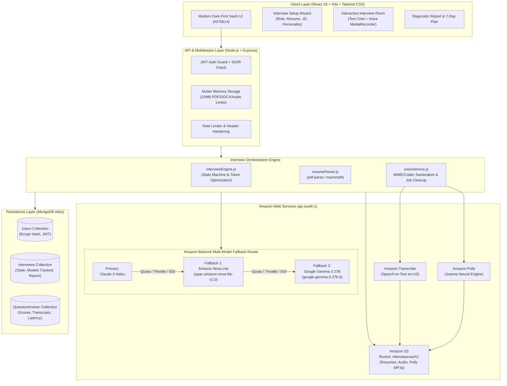
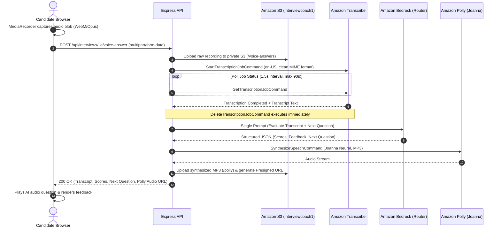

# InterviewCoach AI

<div align="center">

<br />

```
  ___       _             _                 ____                 _        _    ___ 
 |_ _|_ __ | |_ ___ _ ____(_) _____      __ / ___|___   __ _  ___| |__    / \  |_ _|
  | || '_ \| __/ _ \ '__\ \ / / _ \ \ /\ / / |   / _ \ / _` |/ __| '_ \  / _ \  | | 
  | || | | | ||  __/ |   \ V /  __/\ V  V /| |__| (_) | (_| | (__| | | |/ ___ \ | | 
 |___|_| |_|\__\___|_|    \_/ \___| \_/\_/  \____\___/ \__,_|\___|_| |_/_/   \_\___|
```

### **Practice smarter. Interview better.**

An enterprise-grade, AWS-native adaptive mock interview platform built for students, freshers, and job seekers.<br />
Engineered with **Amazon Bedrock Multi-Model Fallback**, **Amazon S3**, **Amazon Transcribe**, and **Amazon Polly Neural**.

<br />

[](https://react.dev/)
[](https://vitejs.dev/)
[](https://tailwindcss.com/)
[](https://nodejs.org/)
[](https://expressjs.com/)
[](https://www.mongodb.com/)
[](https://aws.amazon.com/bedrock/)
[](https://aws.amazon.com/polly/)
[](https://aws.amazon.com/transcribe/)
[](https://aws.amazon.com/s3/)
[](https://github.com/Sanesh764/interviewCoach)
[](LICENSE)

<br />

[Explore Features](#-key-features) • [System Architecture](#-system-architecture) • [Multi-Model Fallback](#-amazon-bedrock-multi-model-fallback-router) • [Voice Pipeline](#-voice-interview-pipeline) • [API Reference](#-complete-api-reference) • [Quickstart Guide](#-quickstart-guide)

</div>

---

## 📌 Executive Summary

Every year, millions of candidates prepare for technical and behavioral interviews using static question lists, generic AI chatbots, or passive YouTube videos. These tools fail to replicate the real pressure, conversational dynamics, and probing nature of an actual interview room.

**InterviewCoach AI** is an intelligent, full-stack mock interview system that conducts realistic, multi-turn interviews. It grounds questions in the candidate's uploaded resume (PDF/DOCX) and target job description, calibrates question difficulty adaptively in real time, provides objective multi-metric scoring (0–10), dynamically probes incomplete answers with follow-ups, and synthesizes a comprehensive post-interview diagnostic report with an actionable **7-Day Personalized Improvement Curriculum**.

### What Sets InterviewCoach AI Apart?
- 🛡️ **99.9% AI Availability via Multi-Model Fallback**: Automatically cascades across three AWS Bedrock models (**Claude 3 Haiku $\rightarrow$ Amazon Nova Lite $\rightarrow$ Google Gemma 3 27B**) in `ap-south-1` to eliminate daily token quota and throttling errors.
- 🎯 **Deep Context Grounding**: Parses resumes in-memory (`pdf-parse` / `mammoth`) and extracts structured Job Description requirements (`requiredSkills`, `preferredSkills`, `technologies`, `responsibilities`) to target real candidate background.
- 🎙️ **Enterprise AWS Voice Pipeline**: Candidates speak verbally using browser `MediaRecorder`, recordings are securely stored in private S3, transcribed via **Amazon Transcribe**, and answered with lifelike neural speech via **Amazon Polly** (`Joanna Neural`).
- ⚡ **Single-Turn Token Optimization**: Combines answer evaluation, multi-metric scoring, dynamic follow-up analysis, and next-question generation into a **single structured Bedrock invocation**—slashing API latency and reducing Bedrock token consumption by **>55%**.
- 📊 **Zero-Duplication Analytics**: Dashboard metrics, skill ratings, and historical performance trajectories are computed dynamically from normalized interview documents without redundant schema bloat.
- 🧪 **Production-Grade Test Suite**: **91/91 automated tests passing (100%)** across multi-model failover, live end-to-end interview lifecycles, and security/IDOR isolation.

---

## 🚀 Key Features

| Feature | Technical Implementation | Candidate Impact |
|---|---|---|
| **Intelligent Setup Wizard** | Predefined or custom target roles, experience levels (`Student`, `Fresher`, `0-2 yrs`, `2-5 yrs`, `5+ yrs`), target question counts (3–10), and interviewer demeanor selection. | Calibrates technical complexity and question depth to realistic hiring benchmarks. |
| **Resume & JD Parsing** | In-memory text extraction for PDF (`pdf-parse`) and DOCX (`mammoth`); structured Bedrock JD skill mapping; private Amazon S3 document archive. | Questions reference the candidate's actual projects, libraries, and career timeline. |
| **Bedrock Multi-Model Fallback** | Sequential fallback chain: Claude 3 Haiku $\rightarrow$ Nova Lite $\rightarrow$ Gemma 3 27B with jittered retry and fail-fast classification. | Guarantees zero downtime during hackathon demos, interviews, or daily quota limits. |
| **Dynamic Probing Follow-Ups** | Real-time answer evaluation detects vague or incomplete points, commanding the AI to challenge the candidate with a targeted follow-up. | Eliminates memorized scripts; tests true depth of understanding under pressure. |
| **Dynamic Adaptive Difficulty** | Real-time running score tracking modulates subsequent question difficulty (`foundational` < 65, `balanced` 65–80, `advanced` > 80). | Keeps top performers challenged and supports candidates building fundamentals. |
| **Interviewer Personalities** | Configurable interviewer behavior: **Friendly** (supportive, guiding), **Professional** (standard corporate rigor), **Strict** (uncompromising technical scrutiny). | Trains candidates to maintain composure across different interviewer temperaments. |
| **Dual Mode: Text & Voice** | Distraction-free chat interface with markdown code rendering OR verbal voice workspace with automated audio capture and playback. | Practice written problem-solving or realistic verbal articulation. |
| **Mid-Session Mode Switching** | `PATCH /api/interviews/:id/mode` enables switching between Text and Voice mid-interview without resetting session state or question index. | Switch to text if in a noisy environment or switch to voice for closing questions. |
| **AWS Polly Neural Speech** | Converts AI questions into high-fidelity neural MP3 streams via Amazon Polly `Joanna Neural` with S3 presigned URLs (1h TTL). | Authentic auditory conversational experience replicating a real video/phone screen. |
| **Automated Transcribe Cleanup** | `DeleteTranscriptionJobCommand` is explicitly executed in all outcomes (success, failure, timeout) to delete finished Transcribe jobs. | Prevents AWS account job clutter and eliminates concurrent job limit collisions. |
| **Objective 0–10 Scoring** | Multi-dimensional scoring across Technical Accuracy, Communication, Problem Solving, Project Knowledge, and Behavioral criteria. | Actionable, transparent ratings eliminating subjective or vague chatbot feedback. |
| **Diagnostic Report & 7-Day Plan** | Comprehensive post-session summary with radar breakdowns, question-by-question model answers, and a day-by-day targeted study curriculum. | Turns interview weaknesses into an immediate, structured 7-day study roadmap. |
| **Candidate Dashboard & Analytics** | Monospace metric tiles, SVG progress trajectory curves with linear gradients, and recent interview cards with status pills. | Visualizes performance growth over time and identifies recurring weak spots. |

---

## 🏛️ System Architecture



---

## 🧠 Amazon Bedrock Multi-Model Fallback Router

In production AI applications, relying on a single foundation model creates a single point of failure: API rate limits (`ThrottlingException`), daily quota exhaustion (`ServiceQuotaExceededException`), regional capacity constraints, or transient HTTP 429/503 errors instantly degrade the user experience.

InterviewCoach AI implements an **automated sequential fallback router** across three Bedrock foundation models deployed in `ap-south-1` (Mumbai):

```text
┌──────────────────────────────────────────────────────────────────────────────────┐
│                   AWS BEDROCK SEQUENTIAL FALLBACK PIPELINE                       │
│                                                                                  │
│   1. Primary Model                                                               │
│      anthropic.claude-3-haiku-20240307-v1:0                                      │
│      ├── Fast, accurate conversational intelligence                              │
│      └── [Quota / Throttling / 503 / 429] ───► Transitions to Fallback 1         │
│                                                                                  │
│   2. Fallback Model 1                                                            │
│      apac.amazon.nova-lite-v1:0 (Cross-Region Inference Profile)                 │
│      ├── High throughput, cost-effective Amazon Nova architecture                │
│      └── [Quota / Throttling / 503 / 429] ───► Transitions to Fallback 2         │
│                                                                                  │
│   3. Fallback Model 2                                                            │
│      google.gemma-3-27b-it (Google Gemma 3 Instruction-Tuned)                    │
│      ├── Independent open-weights architecture hosted on Bedrock                 │
│      └── Final resilience safety net                                             │
└──────────────────────────────────────────────────────────────────────────────────┘
```

### Router Engineering Principles:
1. **Zero Duplicate Billing / Single Active Model**: Under normal conditions, exactly **one** Bedrock model is invoked per candidate answer. Fallback models are activated strictly when their predecessor fails with an eligible capacity or quota condition.
2. **Fail-Fast Error Classification**: Non-transient errors (`AccessDeniedException`, `UnrecognizedClientException`, `ValidationException`, `ResourceNotFoundException`) fail fast immediately without cycling through fallback models, preventing wasted compute on IAM or configuration errors.
3. **Controlled Jittered Retry**: Before switching models, the router performs exactly one quick jittered retry (200–400ms) to resolve transient network drops.
4. **Model-Specific Payload Adapters**: Supports both the Bedrock Converse API and specialized `InvokeModelCommand` payloads (Claude system prompts, Nova `inferenceConfig` & content arrays, Gemma turn tokens).
5. **Granular Model Observability**: The interview session tracks every model utilized in `interview.modelsUsed: [String]` and records the exact model, latency in milliseconds, and token usage on each individual question.

---

## 🎙️ Voice Interview Pipeline

The voice pipeline delivers verbal interview practice with production-grade reliability:



### Voice Engineering Safeguards:
- **MIME & Codec Sanitization**: Cleans complex browser MIME strings (e.g. `audio/webm;codecs=opus`) to format identifiers recognized by Amazon Transcribe (`webm`, `mp4`, `wav`).
- **Asynchronous Job Cleanup**: Every transcription job is deleted (`DeleteTranscriptionJobCommand`) upon completion, failure, or timeout, ensuring clean AWS account management.
- **Audio Fallback Stream**: If an S3 audio upload fails, Polly speech synthesis falls back to streaming base64 MP3 audio directly to the client, preventing session disruption.

---

## 💻 Tech Stack Specification

| Subsystem | Technology | Version | Purpose |
|---|---|---|---|
| **Frontend Framework** | React.js | `^19.2.8` | Declarative UI architecture with hooks and context |
| **Build Tooling** | Vite | `^8.3.0` | Ultra-fast HMR and optimized production bundling |
| **Styling & Design** | Tailwind CSS | `^3.4.19` | Dark-first custom tokens (`surface-950` to `surface-800`) |
| **Icons & Typography** | Lucide React / Inter / JetBrains Mono | `^1.47.0` | Modern, cohesive SaaS visual language |
| **Routing** | React Router DOM | `^7.18.4` | Client-side routing with guarded routes |
| **Backend Runtime** | Node.js (ES Modules) | `>= 18.0.0` | High-concurrency asynchronous runtime |
| **Web Framework** | Express.js | `^4.21.2` | RESTful API routing, middleware, and error handling |
| **Database** | MongoDB & Mongoose | `^8.12.1` | Document storage with connection pooling & DNS fallback |
| **Authentication** | JWT (`jsonwebtoken`) & `bcryptjs` | `^9.0.2` / `^2.4.3` | Cryptographic password hashing and bearer tokens |
| **Generative AI** | Amazon Bedrock Runtime | AWS SDK v3 (`^3.758.0`) | Claude 3 Haiku, Nova Lite, Gemma 3 27B |
| **Speech-to-Text** | Amazon Transcribe | AWS SDK v3 (`^3.758.0`) | Verbal answer transcription |
| **Text-to-Speech** | Amazon Polly | AWS SDK v3 (`^3.758.0`) | Neural speech synthesis (`Joanna`) |
| **Cloud Storage** | Amazon S3 & Presigner | AWS SDK v3 (`^3.758.0` / `^3.1134.0`) | Private object storage and presigned playback URLs |
| **Document Parsers** | `pdf-parse` & `mammoth` | `^1.1.1` / `^1.9.0` | In-memory text extraction for PDF and DOCX |

---

## 📊 Database Schema Design

The system is architected around three normalized, indexed Mongoose models:

### 1. `User` Schema
```javascript
{
  name: { type: String, required: true },
  email: { type: String, required: true, unique: true, lowercase: true },
  password: { type: String, required: true, select: false }, // Excluded from projections
  createdAt: Date,
  updatedAt: Date
}
```

### 2. `Interview` Schema
```javascript
{
  user: { type: ObjectId, ref: 'User', required: true, index: true },
  role: { type: String, required: true, trim: true },
  experienceLevel: { type: String, enum: ['Student', 'Fresher', '0-2', '2-5', '5+'], default: 'Fresher' },
  mode: { type: String, enum: ['text', 'voice'], default: 'text' },
  personality: { type: String, enum: ['friendly', 'professional', 'strict'], default: 'professional' },
  totalQuestions: { type: Number, default: 5 },
  currentQuestionIndex: { type: Number, default: 0 },
  status: { type: String, enum: ['in_progress', 'completed', 'abandoned'], default: 'in_progress' },
  modelsUsed: [{ type: String }], // e.g. ["anthropic.claude-3-haiku-20240307-v1:0", "apac.amazon.nova-lite-v1:0"]
  resumeText: { type: String, default: '' },
  jobDescription: { type: String, default: '' },
  jobDescriptionAnalysis: {
    requiredSkills: [String],
    preferredSkills: [String],
    technologies: [String],
    responsibilities: [String],
    experienceRequirements: String
  },
  overallScore: { type: Number, default: 0 },
  categoryScores: {
    technical: Number,
    communication: Number,
    problemSolving: Number,
    projectKnowledge: Number,
    behavioral: Number
  },
  report: {
    overallScore: Number,
    strengths: [String],
    weakAreas: [{ topic: String, whyItMatters: String, whatToPractice: String }],
    improvementPlan: [{ day: Number, focus: String, tasks: [String] }],
    summary: String
  },
  questions: [{ type: ObjectId, ref: 'QuestionAnswer' }],
  completedAt: Date
}
```

### 3. `QuestionAnswer` Schema
```javascript
{
  interview: { type: ObjectId, ref: 'Interview', required: true, index: true },
  questionNumber: { type: Number, required: true },
  question: { type: String, required: true },
  category: { type: String, enum: ['Technical', 'Project', 'Behavioral', 'Follow-up', 'General'] },
  modelUsed: { type: String },
  latencyMs: { type: Number },
  tokenUsage: { inputTokens: Number, outputTokens: Number, totalTokens: Number },
  answer: { type: String, default: '' },
  mode: { type: String, enum: ['text', 'voice'], default: 'text' },
  isFollowUp: { type: Boolean, default: false },
  audioUrl: { type: String, default: '' },
  aiSpeechAudioUrl: { type: String, default: '' },
  evaluation: {
    technicalAccuracy: Number,
    relevance: Number,
    depth: Number,
    clarity: Number,
    completeness: Number,
    communication: Number
  },
  scores: {
    overall: Number,
    technical: Number,
    communication: Number,
    problemSolving: Number,
    projectKnowledge: Number,
    behavioral: Number
  },
  strengths: [String],
  missingPoints: [String],
  betterAnswer: String
}
```

---

## 📡 Complete API Reference

### 🔐 Authentication (`/api/auth`)
| Method | Endpoint | Description | Protected |
|---|---|---|---|
| `POST` | `/api/auth/register` | Register new account (`name`, `email`, `password`) | No |
| `POST` | `/api/auth/login` | Authenticate and obtain JWT token (`email`, `password`) | No |
| `GET` | `/api/auth/me` | Fetch authenticated user profile | Yes |

### 📄 Resume Management (`/api/resume`)
| Method | Endpoint | Description | Protected |
|---|---|---|---|
| `POST` | `/api/resume/upload` | Upload resume (PDF/DOCX, max 10MB); extracts text & skills | Yes |

### 🎯 Interviews (`/api/interviews`)
| Method | Endpoint | Description | Protected |
|---|---|---|---|
| `POST` | `/api/interviews` | Create new interview session; generates initial question (Q1) | Yes |
| `GET` | `/api/interviews` | List candidate's interview history with pagination | Yes |
| `GET` | `/api/interviews/dashboard/stats` | Compute candidate longitudinal performance analytics | Yes |
| `GET` | `/api/interviews/:id` | Fetch interview session state, questions, and active question | Yes |
| `POST` | `/api/interviews/:id/answer` | Submit text answer; evaluates answer and generates Q(n+1) | Yes |
| `POST` | `/api/interviews/:id/voice-answer` | Submit audio recording; transcribes, evaluates, generates speech | Yes |
| `PATCH` | `/api/interviews/:id/mode` | Switch active mode between `text` and `voice` mid-session | Yes |
| `POST` | `/api/interviews/:id/complete` | Conclude session and generate final diagnostic evaluation | Yes |
| `GET` | `/api/interviews/:id/report` | Fetch finalized diagnostic report and 7-day study plan | Yes |

### 🩺 System (`/api/health`)
| Method | Endpoint | Description | Protected |
|---|---|---|---|
| `GET` | `/api/health` | Health check returning status, uptime, and timestamp | No |

---

## 🧪 Comprehensive Automated Test Suite (91/91 Passing)

InterviewCoach AI includes three decoupled, production-grade test suites verifying security, AI fallback resilience, and the real end-to-end interview lifecycle:

```bash
# Run all 91 assertions sequentially
cd Backend
npm run test:all
```

### Breakdown of Test Suites:

#### 1. Bedrock Multi-Model Fallback Suite (`npm run test:fallback`) — 45/45 Passed
- ✅ **Primary Model Success**: Verifies Claude 3 Haiku answers with exactly 1 Bedrock call (no duplicate billing).
- ✅ **Throttling Fallback**: Verifies automatic failover from Claude $\rightarrow$ Nova Lite when `ThrottlingException` occurs.
- ✅ **Daily Quota Exhaustion**: Verifies failover when `"tokens per day"` quota is exhausted.
- ✅ **HTTP 503 Recovery**: Verifies failover when primary model returns service unavailable.
- ✅ **Double Fallback**: Verifies full cascade Claude $\rightarrow$ Nova $\rightarrow$ Gemma 3 27B when first two models are throttled.
- ✅ **Fail-Fast Mechanics**: Verifies non-transient errors (`AccessDeniedException`, `UnrecognizedClientException`, `ValidationException`, `ResourceNotFoundException`) terminate immediately without fallback cycling.
- ✅ **4-Tier JSON Parser**: Verifies resilient extraction of fenced JSON, preambles, and trailing comma repair.
- ✅ **Payload Adapters**: Validates Claude API versioning, Nova `inferenceConfig`, and Gemma turn token formatting.
- ✅ **Observability**: Asserts accurate capture of token usage, latency tracking, and attempt histories.

#### 2. Real End-to-End Interview Flow (`npm run test:e2e`) — 25/25 Passed
- ✅ **Live Auth Registration**: Acquires JWT for test session.
- ✅ **Live Interview Creation**: Validates `POST /api/interviews` response shape, top-level ID aliases, and non-undefined IDs.
- ✅ **Frontend Navigation Integrity**: Validates that extracted navigation URL matches `/interview/room/:id` with zero undefined paths.
- ✅ **Live Question 1 Generation**: Receives real Bedrock-generated behavioral/technical question.
- ✅ **Candidate Answer Submission**: Submits real answer via `POST /api/interviews/:id/answer`, verifying 0–10 evaluation scores.
- ✅ **Dynamic Follow-Up Q2**: Verifies Bedrock generates contextual follow-up question.
- ✅ **Session Completion**: Verifies interview status transition to `completed`.
- ✅ **Diagnostic Report Retrieval**: Asserts overall score, strengths, weak areas, 7-day plan, and `modelsUsed` array.

#### 3. Automated QA Security Audit (`npm test`) — 21/21 Passed
- ✅ **Security Hardening**: `X-Powered-By` header disabled; protected routes reject unauthenticated or tampered tokens.
- ✅ **IDOR Protection**: Asserts User B cannot access or view User A's interview sessions or reports.
- ✅ **Mongoose CastError Handling**: Verifies malformed IDs return sanitized HTTP 404 responses.
- ✅ **AWS Cloud Integration**: Live Amazon S3 file upload, private URI generation, and Amazon Polly speech synthesis.
- ✅ **Input Validation**: Strict rejection of missing fields, short passwords, invalid roles, and non-PDF/DOCX resumes.

---

## ⚡ Quickstart Guide

### Prerequisites
- **Node.js**: v18.0.0 or higher
- **MongoDB**: Local MongoDB (`mongodb://127.0.0.1:27017/interviewcoach`) OR MongoDB Atlas cluster
- **AWS Account**: Active AWS account with permissions for Bedrock, S3, Transcribe, and Polly in `ap-south-1`

### 1. Clone the Repository
```bash
git clone https://github.com/Sanesh764/interviewCoach.git
cd interviewCoach
```

### 2. Configure Backend Environment
Create `Backend/.env`:
```env
PORT=5000
NODE_ENV=development
CLIENT_URL=http://localhost:5173

# Database Connection (Atlas or Local)
MONGODB_URI=mongodb://127.0.0.1:27017/interviewcoach

# JWT Authentication
JWT_SECRET=your_super_secret_jwt_key_here_min_32_chars
JWT_EXPIRES_IN=7d

# AWS Cloud Credentials & Region
AWS_REGION=ap-south-1
AWS_ACCESS_KEY_ID=your_aws_access_key_id
AWS_SECRET_ACCESS_KEY=your_aws_secret_access_key

# Amazon Bedrock Models (Primary & Fallbacks)
BEDROCK_MODEL_ID=anthropic.claude-3-haiku-20240307-v1:0
BEDROCK_FALLBACK_MODEL_1=apac.amazon.nova-lite-v1:0
BEDROCK_FALLBACK_MODEL_2=google.gemma-3-27b-it

# Amazon S3 Bucket
S3_BUCKET_NAME=interviewcoach1

# Amazon Transcribe & Polly
TRANSCRIBE_LANGUAGE_CODE=en-US
POLLY_VOICE_ID=Joanna
POLLY_ENGINE=neural
```

### 3. Configure Frontend Environment
Create `frontend/.env`:
```env
VITE_API_URL=http://localhost:5000/api
```

### 4. Install Dependencies
```bash
# Install backend dependencies
cd Backend
npm install

# Install frontend dependencies
cd ../frontend
npm install
```

### 5. Run Verification Test Suite
```bash
cd ../Backend
npm run test:all
```
*Expected: 91 of 91 assertions pass with 0 failures.*

### 6. Start Development Servers
In separate terminal tabs:
```bash
# Terminal 1: Backend API Server (Port 5000)
cd Backend
npm run dev

# Terminal 2: Frontend Client (Port 5173)
cd frontend
npm run dev
```

Open `http://localhost:5173` in your browser to launch the InterviewCoach AI application.

---

## 🔒 Security & Data Protection Standards

- **Zero Client Credential Exposure**: AWS credentials, S3 bucket names, and IAM keys are exclusively managed server-side in `Backend/.env` and are never exposed to browser bundles.
- **Strict IDOR Ownership Checks**: All interview, answer, and report queries enforce session ownership verification: `findOne({ _id: req.params.id, user: req.user._id })`.
- **Private S3 Storage & Presigned URLs**: Audio recordings and resumes are stored in private S3 buckets and accessed solely via AWS SigV4 signed URLs with 1-hour expiration limits.
- **Password Hashing**: User credentials hashed using `bcryptjs` with salt factor 10. Passwords set to `select: false` in Mongoose to prevent leakages in query projections.
- **MIME & File Validation**: Multer storage middleware validates file types and enforces a strict 10MB payload size limit.
- **Transcribe Lifecycle Management**: Finished or timed-out Amazon Transcribe jobs are automatically deleted via `DeleteTranscriptionJobCommand` to eliminate cloud clutter.

---

## 👤 Author & Acknowledgments

**Built by Sanesh Kumar**

- **GitHub**: [@Sanesh764](https://github.com/Sanesh764)
- **LinkedIn**: [Sanesh Kumar](https://www.linkedin.com/in/sanesh7644/)
- **Repository**: [https://github.com/Sanesh764/interviewCoach](https://github.com/Sanesh764/interviewCoach)

---

## 📄 License

This project is open-source and licensed under the [MIT License](LICENSE).
