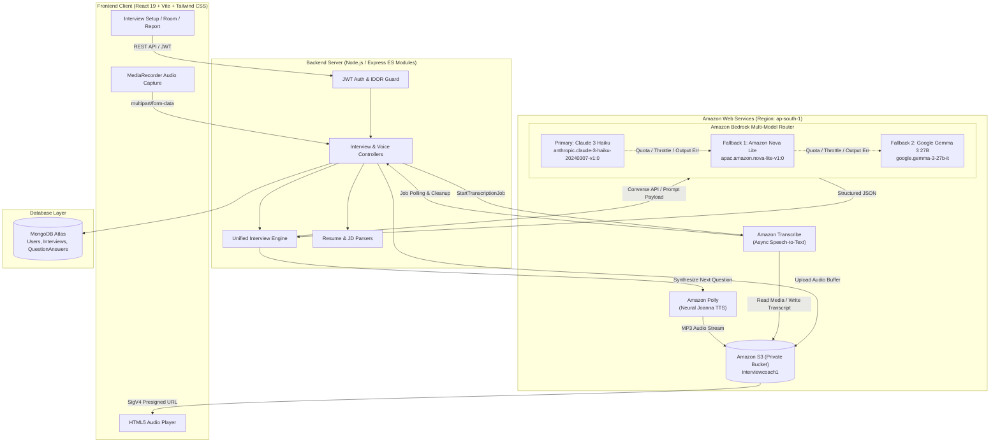
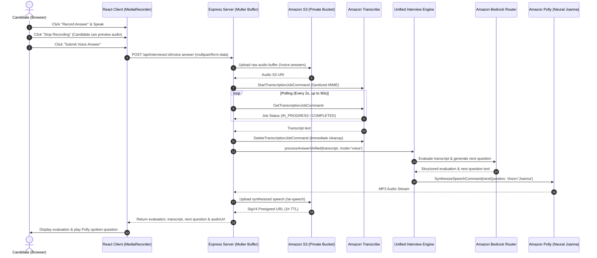
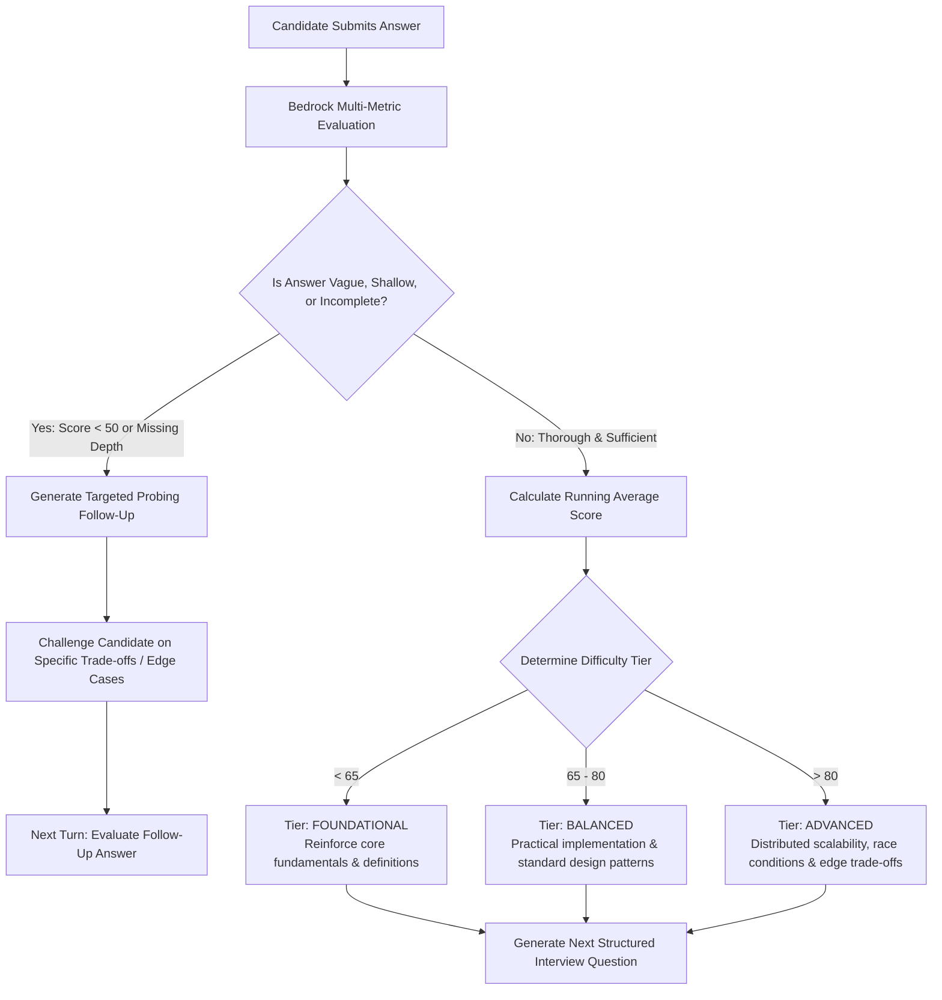

# InterviewCoach AI

> **Practice smarter. Interview better.**

[](https://nodejs.org/)
[](https://expressjs.com/)
[](https://react.dev/)
[](https://vitejs.dev/)
[](https://www.mongodb.com/atlas)
[](https://aws.amazon.com/bedrock/)
[](https://aws.amazon.com/s3/)
[](https://aws.amazon.com/transcribe/)
[](https://aws.amazon.com/polly/)
[](LICENSE)

**InterviewCoach AI** is an AI-powered mock interview and career readiness platform engineered for college students, freshers, and job seekers. It bridges the gap between theoretical knowledge and real-world hiring standards by replacing static question lists and generic chatbots with a context-grounded, adaptive interview workflow powered by **Amazon Web Services (AWS)** in `ap-south-1` (Mumbai).

---

## Table of Contents

- [1. Executive Summary & Core Product Concept](#1-executive-summary--core-product-concept)
- [2. The Problem & The Solution](#2-the-problem--the-solution)
- [3. System Architecture](#3-system-architecture)
- [4. AWS Infrastructure & Service Deep Dive](#4-aws-infrastructure--service-deep-dive)
- [5. Amazon Bedrock Multi-Model Fallback Router](#5-amazon-bedrock-multi-model-fallback-router)
- [6. Recorded-Answer Voice Architecture](#6-recorded-answer-voice-architecture)
- [7. Adaptive Interview Flow & Follow-Up Probing](#7-adaptive-interview-flow--follow-up-probing)
- [8. Resume & Job Description Context Grounding](#8-resume--job-description-context-grounding)
- [9. Multi-Metric Answer Evaluation & 7-Day Improvement Plan](#9-multi-metric-answer-evaluation--7-day-improvement-plan)
- [10. Complete REST API Reference](#10-complete-rest-api-reference)
- [11. Database Schema & Data Models](#11-database-schema--data-models)
- [12. Automated Testing & Verification Suite](#12-automated-testing--verification-suite)
- [13. Technology Stack Summary](#13-technology-stack-summary)
- [14. Local Setup & Quickstart Guide](#14-local-setup--quickstart-guide)
- [15. Security, Privacy & Data Protection](#15-security-privacy--data-protection)
- [16. Open Source & License](#16-open-source--license)

---

## 1. Executive Summary & Core Product Concept

Traditional interview preparation suffers from a broken feedback loop. Candidates either memorize static LeetCode solutions or engage in unstructured conversations with conversational AI bots where the candidate drives the dialogue.

InterviewCoach AI orchestrates a closed-loop engineering cycle:

```text
Practice → Interview → Objective Feedback → Weakness Detection → Personalized 7-Day Plan → Practice Again
```

### Core Product Capabilities
- **Context-Grounded Ingestion**: Ingests the candidate's actual resume (PDF/DOCX) and the target Job Description (JD) to generate authentic, role-specific questions rather than generic textbook prompts.
- **Adaptive Difficulty Scaling**: Continuously tracks candidate performance across difficulty tiers (`foundational` < 65, `balanced` 65–80, `advanced` > 80).
- **Intelligent Follow-Up Probing**: Detects vague, shallow, or incomplete answers and triggers dynamic follow-up questions challenging the candidate on trade-offs and edge cases.
- **Unified Text & Voice Engine**: Supports both typed answers and recorded verbal responses via Amazon Transcribe and Amazon Polly, with seamless mid-session mode toggling (`PATCH /api/interviews/:id/mode`).
- **Resilient Multi-Model Bedrock Router**: Protects session uptime with a sequential fallback chain across three distinct foundation models: **Anthropic Claude 3 Haiku** $\rightarrow$ **Amazon Nova Lite** $\rightarrow$ **Google Gemma 3 27B**.
- **Actionable Post-Interview Diagnostics**: Provides granular multi-dimensional scoring (0–10 criteria, 0–100 categories), model exemplar answers, and an automated 7-Day targeted remediation curriculum.

---

## 2. The Problem & The Solution

| Industry Problem | How InterviewCoach AI Solves It |
|---|---|
| **Chatbots talk too much and lack interview pressure.** Candidates end up leading the conversation instead of learning how to answer under evaluation. | **AI Interviewer drives the session**: Enforces interviewer persona (`friendly`, `professional`, `strict`), maintains interview cadence, asks targeted questions, and awaits candidate responses. |
| **Generic, ungrounded questions** that ignore the candidate's actual background and the company's real requirements. | **Dual Context Grounding**: Extracts candidate projects, technologies, and achievements from resumes and matches them against analyzed JD responsibilities. |
| **Lack of verbal practice**: 90% of real interviews are spoken, yet candidates prepare almost exclusively by typing or reading. | **Recorded Voice Pipeline**: Candidates record spoken responses; the audio is transcribed via Amazon Transcribe and the next AI response is spoken back via Amazon Polly Neural speech. |
| **Superficial praise without actionable guidance** ("Great job! Just be more confident."). | **Multi-Metric Rubrics & Exemplars**: Scored across 6 objective criteria (0–10) and 5 categories (0–100), complemented by bulleted strengths, missing points, and a full model answer. |
| **No structured remediation plan** after identifying weak areas. | **Automated 7-Day Curriculum**: Transforms detected deficiencies into a prioritized daily study and practice roadmap. |

---

## 3. System Architecture


```mermaid
flowchart TD
    subgraph Client["Frontend Client (React 19 + Vite + Tailwind CSS)"]
        UI[Interview Setup / Room / Report]
        REC[MediaRecorder Audio Capture]
        AUD[HTML5 Audio Player]
    end

    subgraph API["Backend Server (Node.js / Express ES Modules)"]
        AUTH[JWT Auth & IDOR Guard]
        ROUTER[Interview & Voice Controllers]
        ENGINE[Unified Interview Engine]
        PARSER[Resume & JD Parsers]
    end

    subgraph AWS["Amazon Web Services (Region: ap-south-1)"]
        subgraph Bedrock["Amazon Bedrock Multi-Model Router"]
            CLAUDE["Primary: Claude 3 Haiku<br/>anthropic.claude-3-haiku-20240307-v1:0"]
            NOVA["Fallback 1: Amazon Nova Lite<br/>apac.amazon.nova-lite-v1:0"]
            GEMMA["Fallback 2: Google Gemma 3 27B<br/>google.gemma-3-27b-it"]
        end
        S3[("Amazon S3 (Private Bucket)<br/>interviewcoach1")]
        TRANSCRIBE["Amazon Transcribe<br/>(Async Speech-to-Text)"]
        POLLY["Amazon Polly<br/>(Neural Joanna TTS)"]
    end

    subgraph DB["Database Layer"]
        MONGO[("MongoDB Atlas<br/>Users, Interviews, QuestionAnswers")]
    end

    %% Flow Connections
    UI -->|REST API / JWT| AUTH
    AUTH --> ROUTER
    ROUTER --> ENGINE
    ROUTER --> PARSER

    %% S3 & Voice flows
    REC -->|multipart/form-data| ROUTER
    ROUTER -->|Upload Audio Buffer| S3
    ROUTER -->|StartTranscriptionJob| TRANSCRIBE
    TRANSCRIBE -->|Read Media / Write Transcript| S3
    TRANSCRIBE -->|Job Polling & Cleanup| ROUTER

    %% AI flow
    ENGINE -->|Converse API / Prompt Payload| Bedrock
    CLAUDE -.->|Quota / Throttle / Output Err| NOVA
    NOVA -.->|Quota / Throttle / Output Err| GEMMA
    Bedrock -->|Structured JSON| ENGINE

    %% Speech synthesis
    ENGINE -->|Synthesize Next Question| POLLY
    POLLY -->|MP3 Audio Stream| S3
    S3 -->|SigV4 Presigned URL| AUD

    %% Persistence
    ROUTER --> MONGO
```

### Architectural Principles
1. **Decoupled Architecture**: Stateless Express REST API communicating with a reactive client. Authentication state is managed via secure JWT tokens and verified against MongoDB Atlas.
2. **Unified Interview Engine**: Text and Voice modes execute the exact same business logic in `interviewEngine.js`. When a voice response is transcribed, it flows through the exact same scoring, follow-up decision tree, and difficulty adaptation routines as typed answers.
3. **Private Binary Offloading**: All binary assets (PDF/DOCX resumes, raw voice recordings, synthesized speech files) are stored strictly in private Amazon S3 buckets. Database records store only object keys, metadata, and temporary presigned URLs.

---

## 4. AWS Infrastructure & Service Deep Dive

InterviewCoach AI leverages native AWS SDK v3 packages (`@aws-sdk/*`) deployed within the `ap-south-1` (Asia Pacific - Mumbai) region:

| AWS Service | Official SDK Package | Role in Architecture & Implementation Details |
|---|---|---|
| **Amazon Bedrock Runtime** | `@aws-sdk/client-bedrock-runtime` | **Cognitive Intelligence & Reasoning Engine**<br />- Generates job-description skill breakdowns.<br />- Formulates grounded initial and follow-up interview questions.<br />- Evaluates answers across multi-dimensional rubrics.<br />- Synthesizes the final diagnostic report and 7-Day Improvement Plan.<br />- Implements a resilient 3-model fallback router with Converse API standardization. |
| **Amazon Simple Storage Service (S3)** | `@aws-sdk/client-s3`<br />`@aws-sdk/s3-request-presigner` | **Private Cloud Storage & Secure Streaming**<br />- Stores uploaded resumes under `resumes/`.<br />- Stores candidate voice recordings under `voice-answers/`.<br />- Stores synthesized audio questions under `ai-speech/`.<br />- Private bucket isolation (`interviewcoach1`); audio playback and downloads are authorized strictly via time-limited **AWS SigV4 Presigned URLs** (1-hour TTL). |
| **Amazon Transcribe** | `@aws-sdk/client-transcribe` | **Asynchronous Speech-to-Text Transcription**<br />- Processes candidate audio recordings with MIME sanitization (`webm`, `mp4`, `wav`).<br />- Uses asynchronous job tracking with timeout guards (up to 90 seconds).<br />- Executes automated resource hygiene: dispatches `DeleteTranscriptionJobCommand` immediately upon job completion or failure to prevent hitting concurrent job limits. |
| **Amazon Polly** | `@aws-sdk/client-polly` | **Conversational Speech Synthesis**<br />- Transforms AI-generated questions into natural human speech using the **`Joanna` Neural** engine.<br />- Streams synthesized MP3 audio directly to Amazon S3 for presigned playback.<br />- Features an inline Base64 data-URI fallback to ensure speech playback is maintained even during transient S3 write hiccups. |

---

## 5. Amazon Bedrock Multi-Model Fallback Router

In production AI systems, relying on a single foundation model introduces critical single-point-of-failure vulnerabilities due to regional capacity spikes, token rate limits (`ThrottlingException`), service quota exhaustion (`ServiceQuotaExceededException`), or occasional malformed JSON responses.

InterviewCoach AI implements an **automated, sequential multi-model Bedrock fallback router** with end-to-end response validation inside each model attempt:

```text
Incoming Interview Request
           │
           ▼
┌────────────────────────────────────────────────────────────────────────┐
│  Bedrock Model Router (ap-south-1)                                     │
└──────────────────────────────────┬─────────────────────────────────────┘
                                   │
                                   ▼
┌────────────────────────────────────────────────────────────────────────┐
│  PRIMARY: Anthropic Claude 3 Haiku                                     │
│  Model ID: anthropic.claude-3-haiku-20240307-v1:0                      │
│  Fast, cost-effective reasoning for conversational interviews          │
└──────────────────────────────────┬─────────────────────────────────────┘
                                   │ (Throttling / Quota / 503 / Malformed Output)
                                   ▼
┌────────────────────────────────────────────────────────────────────────┐
│  FALLBACK 1: Amazon Nova Lite                                          │
│  Model ID: apac.amazon.nova-lite-v1:0 (Cross-Region Inference Profile) │
│  High-throughput, lightweight multimodal foundation model              │
└──────────────────────────────────┬─────────────────────────────────────┘
                                   │ (Throttling / Quota / 503 / Malformed Output)
                                   ▼
┌────────────────────────────────────────────────────────────────────────┐
│  FALLBACK 2: Google Gemma 3 27B                                        │
│  Model ID: google.gemma-3-27b-it                                       │
│  Open-weights instruction-tuned high-capacity model on Bedrock         │
└──────────────────────────────────┬─────────────────────────────────────┘
                                   │
                                   ▼
                Structured JSON Response Delivered to Engine
```

### Complete Model Attempt Lifecycle
A model attempt is **not** considered successful merely because the HTTP call to AWS Bedrock returned a 200 status code. The router requires the full lifecycle to succeed:

$$\text{Bedrock Invoke} \longrightarrow \text{Response Normalization} \longrightarrow \text{JSON Extraction} \longrightarrow \text{Schema Validation}$$

If a model returns a truncated response (e.g. `stopReason: "max_tokens"`), incomplete JSON, or missing required schema keys, it throws a `ModelOutputValidationException`. The router classifies this as a retryable model-level failure, executes one short jittered retry, and if still unsuccessful, transitions seamlessly to the next model in the fallback chain.

### Router Mechanics & Engineering Guardrails:
1. **Sequential Execution (Zero Redundant Billing)**: Under normal conditions, **only the primary model is invoked**. Fallback models are activated if and only if the preceding model encounters an eligible transient failure.
2. **Deterministic Fail-Fast Classification**: The router distinguishes between transient capacity/output issues and deterministic configuration errors:
   - **Eligible for Retry & Fallback**: `ThrottlingException`, `ServiceQuotaExceededException`, HTTP 429, HTTP 503, rate-limit messages, and `ModelOutputValidationException`.
   - **Fail-Fast (No Fallback Cycling)**: `AccessDeniedException`, `UnrecognizedClientException`, `ValidationException` (malformed client request parameters), `ResourceNotFoundException` (invalid model identifier), and internal programming errors (`TypeError`, `ReferenceError`).
3. **Jittered Backoff Retry**: Before progressing to the subsequent fallback model, the active model performs one jittered retry (200–400ms delay) to smooth out momentary AWS network blips.
4. **Resilient 4-Tier JSON Parser**: Handles responses across various model behaviors:
   - *Tier 1*: Direct JSON parsing.
   - *Tier 2*: Markdown code fence isolation (````json ... ````).
   - *Tier 3*: Outermost bracket scanning (`{ ... }`).
   - *Tier 4*: Trailing comma sanitation prior to closing braces.
5. **Observability & Attribution**: The session preserves a comprehensive audit trail:
   - `interview.modelsUsed: [String]`: Array of every distinct model that contributed to the interview session.
   - `qa.modelUsed`: The exact model that generated and evaluated each specific question.
   - `qa.latencyMs`: Network round-trip and processing latency for each turn.
   - `qa.tokenUsage`: Granular token accounting (`inputTokens`, `outputTokens`, `totalTokens`).

> **Cost & Availability Transparency**: The fallback router optimizes session resilience against temporary rate limits and regional capacity issues. Failed upstream requests may still incur standard provider charges depending on Bedrock processing stages, and fallback does not guarantee zero downtime if all configured foundation models are simultaneously unavailable.

---

## 6. Recorded-Answer Voice Architecture

InterviewCoach AI provides an explicit recorded-answer voice experience designed for deterministic reliability without the network instability of complex WebRTC streams:


```mermaid
sequenceDiagram
    autonumber
    actor User as Candidate (Browser)
    participant Client as React Client (MediaRecorder)
    participant Server as Express Server (Multer Buffer)
    participant S3 as Amazon S3 (Private Bucket)
    participant Transcribe as Amazon Transcribe
    participant Engine as Unified Interview Engine
    participant Bedrock as Amazon Bedrock Router
    participant Polly as Amazon Polly (Neural Joanna)

    User->>Client: Click "Record Answer" & Speak
    User->>Client: Click "Stop Recording" (Candidate can preview audio)
    User->>Client: Click "Submit Voice Answer"
    Client->>Server: POST /api/interviews/:id/voice-answer (multipart/form-data)
    Server->>S3: Upload raw audio buffer (/voice-answers)
    S3-->>Server: Audio S3 URI
    Server->>Transcribe: StartTranscriptionJobCommand (Sanitized MIME)
    loop Polling (Every 2s, up to 90s)
        Server->>Transcribe: GetTranscriptionJobCommand
        Transcribe-->>Server: Job Status (IN_PROGRESS / COMPLETED)
    end
    Transcribe-->>Server: Transcript text
    Server->>Transcribe: DeleteTranscriptionJobCommand (Immediate cleanup)
    Server->>Engine: processAnswerUnified(transcript, mode='voice')
    Engine->>Bedrock: Evaluate transcript & generate next question
    Bedrock-->>Engine: Structured evaluation & next question text
    Engine->>Polly: SynthesizeSpeechCommand(nextQuestion, Voice='Joanna')
    Polly-->>Server: MP3 Audio Stream
    Server->>S3: Upload synthesized speech (/ai-speech)
    S3-->>Server: SigV4 Presigned URL (1h TTL)
    Server-->>Client: Return evaluation, transcript, next question & audioUrl
    Client->>User: Display evaluation & play Polly spoken question
```

### Voice Pipeline Engineering Guarantees:
- **Explicit Candidate Submission**: Candidates record, listen to playback in-browser, and explicitly click submit—eliminating inadvertent speech truncation and background noise submission.
- **Audio MIME Sanitization**: Translates diverse browser container strings (e.g. `audio/webm;codecs=opus` on Chrome, `audio/mp4` on Safari) into strict formats accepted by Amazon Transcribe (`webm`, `mp4`, `wav`).
- **Automated Cloud Hygiene**: All Transcribe jobs trigger `DeleteTranscriptionJobCommand` immediately upon completion or failure, maintaining clean AWS quotas.
- **Mid-Session Mode Flexibility**: Candidates can switch between voice and text at any point during an active interview via `PATCH /api/interviews/:id/mode`.

---

## 7. Adaptive Interview Flow & Follow-Up Probing

Instead of sequentially traversing a fixed list of questions ($Q1 \rightarrow Q2 \rightarrow Q3$), InterviewCoach AI implements a dynamic state machine that reacts to candidate performance in real time:


```mermaid
flowchart TD
    A[Candidate Submits Answer] --> B[Bedrock Multi-Metric Evaluation]
    B --> C{Is Answer Vague, Shallow, or Incomplete?}

    C -->|Yes: Score < 50 or Missing Depth| D[Generate Targeted Probing Follow-Up]
    D --> E[Challenge Candidate on Specific Trade-offs / Edge Cases]
    E --> F[Next Turn: Evaluate Follow-Up Answer]

    C -->|No: Thorough & Sufficient| G[Calculate Running Average Score]
    G --> H{Determine Difficulty Tier}

    H -->|< 65| I[Tier: FOUNDATIONAL<br/>Reinforce core fundamentals & definitions]
    H -->|65 - 80| J[Tier: BALANCED<br/>Practical implementation & standard design patterns]
    H -->|> 80| K[Tier: ADVANCED<br/>Distributed scalability, race conditions & edge trade-offs]

    I --> L[Generate Next Structured Interview Question]
    J --> L
    K --> L
```

### Dynamic Difficulty Tiers:
In `Backend/src/services/interview/interviewEngine.js`, difficulty is dynamically calibrated against running category performance:
- **`foundational`** (Average Score < 65): Targets fundamental definitions, basic syntax, core data structures, and foundational principles to rebuild candidate confidence.
- **`balanced`** (Average Score 65–80): Targets real-world implementation, standard architectural patterns, framework mechanics, and pragmatic trade-offs.
- **`advanced`** (Average Score > 80): Targets distributed scalability, race conditions, memory bottlenecks, high-throughput failure modes, and deep architectural trade-offs.

---

## 8. Resume & Job Description Context Grounding

Generic interview bots ask standard textbook questions that fail to prepare candidates for company-specific hiring bars. InterviewCoach AI grounds every session in candidate-supplied documents:

1. **Candidate Resume Ingestion**: Parsed in-memory via `pdf-parse` (PDF) or `mammoth` (DOCX), extracting declared skills, personal projects, technologies, and work history.
2. **Target Job Description Ingestion**: Analyzed by Amazon Bedrock to extract structured `requiredSkills`, `preferredSkills`, `technologies`, and key `responsibilities`.

### Real-World Question Comparison:

```text
❌ Generic Interview Bot:
"Tell me about your experience with backend web development and database management."

✅ InterviewCoach AI (Context-Grounded):
"In your resume, you highlighted building a collaborative document editor using Node.js, 
MongoDB, and WebSockets. The Job Description for this Backend Role emphasizes high 
concurrency and data consistency. 

How did you handle concurrent document edits from multiple users, and why did you choose 
MongoDB's document model over an operational transform engine or CRDTs?"
```

---

## 9. Multi-Metric Answer Evaluation & 7-Day Improvement Plan

Every candidate answer is evaluated across structured criteria rather than receiving an uninformative percentage score.

### Implemented Scoring Criteria (0–10):
- **Technical Accuracy** (0–10): Factual correctness, precision of terminology, and conceptual validity.
- **Relevance** (0–10): Directness in addressing the question without off-topic filler.
- **Depth** (0–10): Understanding of underlying mechanisms, internals, and trade-offs.
- **Clarity** (0–10): Structural organization, articulation, and coherence.
- **Completeness** (0–10): Coverage of edge cases, failure states, and security considerations.
- **Communication** (0–10): Professional verbal or written phrasing and pacing.

### Aggregate Category Dimensions (0–100):
Scores are aggregated across five distinct interview categories:
- `technical`
- `communication`
- `problemSolving`
- `projectKnowledge`
- `behavioral`

### Actionable Feedback Components:
- **Strengths**: Specific concepts, trade-offs, and details the candidate articulated well.
- **Missing Points**: Critical architectural details, edge cases, or performance considerations that were omitted.
- **Better Answer**: A concise, production-grade model answer illustrating how a senior engineer would respond.

### Automated 7-Day Personalized Improvement Plan:
Upon interview completion, the engine aggregates detected weaknesses into an actionable daily study roadmap:
- **Day 1**: Targeted remediation of the most critical conceptual gap identified in the session.
- **Day 2**: Deep dive into core system architecture and trade-off analysis.
- **Days 3–4**: Hands-on coding exercises, edge-case implementation, and debugging practice.
- **Days 5–6**: Articulation drills, framing technical decisions, and behavioral practice (STAR method).
- **Day 7**: Full-length mock interview re-assessment to measure score velocity and retention.

---

## 10. Complete REST API Reference

All protected endpoints require an `Authorization: Bearer <token>` header.

### Authentication Endpoints
| Method | Endpoint | Description | Auth Required |
|---|---|---|---|
| `POST` | `/api/auth/register` | Register a new user (`name`, `email`, `password`) | No |
| `POST` | `/api/auth/login` | Authenticate user credentials & return JWT token | No |
| `GET` | `/api/auth/me` | Fetch authenticated user profile | Yes |

### Resume Upload Endpoints
| Method | Endpoint | Description | Auth Required |
|---|---|---|---|
| `POST` | `/api/resume/upload` | Upload and parse resume (`multipart/form-data`, PDF/DOCX) | Yes |

### Interview Lifecycle Endpoints
| Method | Endpoint | Description | Auth Required |
|---|---|---|---|
| `POST` | `/api/interviews` | Create & initialize interview session (`role`, `mode`, `experienceLevel`, `personality`, `resumeData`, `jobDescription`) | Yes |
| `GET` | `/api/interviews` | Retrieve authenticated user's interview history | Yes |
| `GET` | `/api/interviews/dashboard/stats` | Retrieve aggregated performance metrics & interview counts | Yes |
| `GET` | `/api/interviews/:id` | Fetch interview session state, current question, and history | Yes |
| `POST` | `/api/interviews/:id/answer` | Submit typed text answer (`{ answer: string }`) | Yes |
| `POST` | `/api/interviews/:id/voice-answer` | Submit recorded audio answer (`multipart/form-data`, field: `audio`) | Yes |
| `PATCH` | `/api/interviews/:id/mode` | Switch session mode between `text` and `voice` (`{ mode: "text" \| "voice" }`) | Yes |
| `POST` | `/api/interviews/:id/complete` | Complete interview session early & generate final diagnostic report | Yes |
| `GET` | `/api/interviews/:id/report` | Fetch final diagnostic report and 7-Day Improvement Plan | Yes |

### Health Endpoint
| Method | Endpoint | Description | Auth Required |
|---|---|---|---|
| `GET` | `/health` | System health check & active timestamp | No |

---

## 11. Database Schema & Data Models

### User Schema (`User.js`)
```javascript
{
  name: { type: String, required: true, maxlength: 50 },
  email: { type: String, required: true, unique: true, lowercase: true },
  password: { type: String, required: true, minlength: 6, select: false },
  createdAt: { type: Date },
  updatedAt: { type: Date }
}
```

### Interview Schema (`Interview.js`)
```javascript
{
  userId: { type: ObjectId, ref: 'User', required: true, index: true },
  role: { type: String, required: true },
  experienceLevel: { type: String, enum: ['Student', 'Fresher', '0-2 years', '2-5 years', '5+ years'], default: 'Fresher' },
  mode: { type: String, enum: ['text', 'voice'], default: 'text' },
  personality: { type: String, enum: ['friendly', 'professional', 'strict'], default: 'professional' },
  totalQuestionsTarget: { type: Number, default: 5 },
  currentQuestionIndex: { type: Number, default: 1 },
  status: { type: String, enum: ['in_progress', 'completed', 'abandoned'], default: 'in_progress' },
  resumeData: {
    fileName: String,
    fileUrl: String,
    rawText: String,
    skills: [String],
    projects: [String],
    experience: [String],
    technologies: [String],
    education: [String]
  },
  jobDescription: String,
  jobDescriptionAnalysis: {
    requiredSkills: [String],
    preferredSkills: [String],
    technologies: [String],
    responsibilities: [String],
    experienceRequirements: String
  },
  overallScore: { type: Number, default: 0 },
  categoryScores: {
    technical: Number,
    communication: Number,
    problemSolving: Number,
    projectKnowledge: Number,
    behavioral: Number
  },
  report: {
    strengths: [String],
    weakAreas: [{
      topic: String,
      whatWasMissing: String,
      whyItMatters: String,
      whatToPractice: String
    }],
    improvementPlan: [{
      day: Number,
      title: String,
      focus: String,
      tasks: [String]
    }],
    summary: String
  },
  questions: [{ type: ObjectId, ref: 'QuestionAnswer' }],
  modelsUsed: [String],             // Complete audit list of models invoked during interview
  finalReportModelUsed: String,     // Specific model that synthesized the final diagnostic report
  completedAt: Date
}
```

### QuestionAnswer Schema (`QuestionAnswer.js`)
```javascript
{
  interviewId: { type: ObjectId, ref: 'Interview', required: true, index: true },
  questionNumber: { type: Number, required: true },
  question: { type: String, required: true },
  category: { type: String, enum: ['Technical', 'Project', 'Behavioral', 'Follow-up', 'General'], default: 'Technical' },
  audioUrl: String,                 // S3 URI of candidate's voice answer
  aiSpeechAudioUrl: String,         // Presigned S3 URL of synthesized Polly question
  answer: String,                   // Raw or transcribed candidate answer
  transcript: String,               // Transcribed text from Amazon Transcribe
  mode: { type: String, enum: ['text', 'voice'], default: 'text' },
  isFollowUp: { type: Boolean, default: false },
  evaluation: {
    technicalAccuracy: { type: Number, min: 0, max: 10 },
    relevance: { type: Number, min: 0, max: 10 },
    depth: { type: Number, min: 0, max: 10 },
    clarity: { type: Number, min: 0, max: 10 },
    completeness: { type: Number, min: 0, max: 10 },
    communication: { type: Number, min: 0, max: 10 }
  },
  scores: {
    overall: { type: Number, min: 0, max: 100 },
    technical: Number,
    communication: Number,
    problemSolving: Number,
    projectKnowledge: Number,
    behavioral: Number
  },
  strengths: [String],
  missingPoints: [String],
  betterAnswer: String,
  feedback: String,
  modelUsed: String,                // Model responsible for this turn (e.g. anthropic.claude-3-haiku...)
  latencyMs: Number,                // Latency in milliseconds
  tokenUsage: {
    inputTokens: Number,
    outputTokens: Number,
    totalTokens: Number
  }
}
```

---

## 12. Automated Testing & Verification Suite

The repository includes **105 automated test assertions** verifying model routing, voice pipelines, security headers, authentication, and session state integrity:

```text
=============================================================================
SUITE                                  TEST FILE                     ASSERTIONS
=============================================================================
1. Bedrock Multi-Model Router Tests   Backend/tests/model_fallback_test.js   59
2. End-to-End Live Interview Tests     Backend/tests/e2e_interview_flow_test.js 25
3. Pre-Deployment Security QA Audit    Backend/qa_audit_test.js              21
-----------------------------------------------------------------------------
TOTAL AUTOMATED ASSERTIONS                                                  105
=============================================================================
```

### Running the Test Suites

#### 1. Bedrock Multi-Model Fallback Router Suite (59 Tests)
*Standalone mock and contract verification suite. Runs offline without requiring a live MongoDB or AWS connection.*
```bash
cd Backend
npm run test:fallback
```
**Coverage Highlights:**
- Sequential fallback progression: Claude $\rightarrow$ Nova Lite $\rightarrow$ Gemma 3 27B.
- Fail-fast enforcement on non-transient IAM, credential, and client validation errors.
- Retry and fallback triggers for `ModelOutputValidationException` (malformed, schema-invalid, or truncated output).
- Truncation detection when `stopReason` is `"max_tokens"`.
- Jittered retry timing and token/latency tracking validation.

#### 2. Live End-to-End Interview Flow Suite (25 Tests)
*Validates full browser/API user journeys against a running backend and database.*
```bash
# Terminal 1: Start backend server
cd Backend
npm run dev

# Terminal 2: Execute E2E suite
cd Backend
npm run test:e2e
```
**Coverage Highlights:**
- User registration, login, and JWT verification.
- Resume upload, file format validation, and text extraction.
- Interview initialization, initial question generation, and score tracking.
- Text answer evaluation, follow-up generation, and category score derivation.
- Session completion, diagnostic report structure, and 7-day curriculum verification.

#### 3. Security & QA Audit Suite (21 Tests)
*Verifies API hardening, header security, and multi-tenant IDOR protection.*
```bash
# Ensure server is running on port 5000:
cd Backend
npm test
```
**Coverage Highlights:**
- `X-Powered-By` header suppression.
- IDOR isolation: confirms User B cannot access User A's interviews or reports.
- Password minimum length enforcement and bcrypt hashing validation.
- Amazon S3 private storage access and Amazon Polly speech stream synthesis.

---

## 13. Technology Stack Summary

### Frontend Architecture
- **Framework**: React 19 (`^19.2.8`)
- **Build Tool**: Vite (`^8.3.0`)
- **Styling**: Tailwind CSS (`^3.4.19`) with custom dark tokens (`#070b14`, `#0c1222`, `#11182c`)
- **Routing**: React Router DOM (`^7.18.4`)
- **Icons**: Lucide React (`^1.47.0`)
- **HTTP Client**: Axios (`^1.20.0`)
- **Audio Capture**: Browser MediaRecorder API with cross-browser WebM/MP4 fallback

### Backend Architecture
- **Runtime**: Node.js (ES Modules, `>= 18.0.0`)
- **Framework**: Express.js (`^4.21.2`)
- **Database**: MongoDB Atlas via Mongoose (`^8.12.1`)
- **Authentication**: JSON Web Tokens (`jsonwebtoken` `^9.0.2`) and `bcryptjs` (`^2.4.3`)
- **File Ingestion**: Multer memory storage (`^1.4.5-lts.1`) with 10MB file limit
- **Document Parsers**: `pdf-parse` (`^1.1.1`) and `mammoth` (`^1.9.0`)

### AWS Cloud Integration
- **SDK**: AWS SDK for JavaScript v3 (`@aws-sdk/*` `^3.758.0`)
- **Region**: `ap-south-1` (Asia Pacific - Mumbai)
- **Foundation Models**:
  - `anthropic.claude-3-haiku-20240307-v1:0` (Primary)
  - `apac.amazon.nova-lite-v1:0` (Fallback 1, Cross-Region Profile)
  - `google.gemma-3-27b-it` (Fallback 2)
- **Object Storage**: Amazon S3 (Private bucket `interviewcoach1`, SigV4 presigned URLs)
- **Speech Processing**: Amazon Transcribe (Asynchronous with automated job cleanup)
- **Speech Synthesis**: Amazon Polly (`Joanna` Neural engine)

---

## 14. Local Setup & Quickstart Guide

### Prerequisites
- **Node.js**: `v18.0.0` or higher installed
- **MongoDB**: Local MongoDB instance (`mongodb://127.0.0.1:27017/interviewcoach`) or MongoDB Atlas connection string
- **AWS IAM User**: Provisioned with permissions for Bedrock, S3, Transcribe, and Polly in `ap-south-1`

### 1. Clone the Repository
```bash
git clone https://github.com/Sanesh764/interviewCoach.git
cd interviewCoach
```

### 2. Backend Configuration
```bash
cd Backend
npm install
```

Create a `.env` file inside the `Backend/` folder:
```env
PORT=5000
NODE_ENV=development
CLIENT_URL=http://localhost:5173

# MongoDB Connection
MONGODB_URI=mongodb://127.0.0.1:27017/interviewcoach

# Authentication
JWT_SECRET=replace_with_a_secure_random_string_at_least_32_characters_long
JWT_EXPIRES_IN=7d

# AWS Cloud Configuration (ap-south-1)
AWS_REGION=ap-south-1
AWS_ACCESS_KEY_ID=your_aws_access_key_id
AWS_SECRET_ACCESS_KEY=your_aws_secret_access_key

# Amazon Bedrock Foundation Models
BEDROCK_MODEL_ID=anthropic.claude-3-haiku-20240307-v1:0
BEDROCK_FALLBACK_MODEL_1=apac.amazon.nova-lite-v1:0
BEDROCK_FALLBACK_MODEL_2=google.gemma-3-27b-it

# Amazon S3 Bucket
S3_BUCKET_NAME=interviewcoach1

# Amazon Transcribe & Polly Settings
TRANSCRIBE_LANGUAGE_CODE=en-US
POLLY_VOICE_ID=Joanna
POLLY_ENGINE=neural
```

### 3. Frontend Configuration
```bash
cd ../frontend
npm install
```

Create a `.env` file inside the `frontend/` folder:
```env
VITE_API_URL=http://localhost:5000/api
```

### 4. Run Automated Fallback Tests
Confirm that the Bedrock fallback routing and JSON extraction logic is functioning properly:
```bash
cd ../Backend
npm run test:fallback
```

### 5. Launch Development Servers
Open two terminal windows:

**Terminal 1 (Backend Server):**
```bash
cd Backend
npm run dev
# Server runs on http://localhost:5000
```

**Terminal 2 (Frontend Client):**
```bash
cd frontend
npm run dev
# Client runs on http://localhost:5173
```

Open `http://localhost:5173` in your browser to register an account and start your first interview session.

---

## 15. Security, Privacy & Data Protection

InterviewCoach AI follows production engineering practices to protect candidate data and cloud resources:

- **Strict Identity & Ownership Verification (IDOR Defense)**: Every interview and report query is isolated to the authenticated user via compound database filters (`Interview.findOne({ _id: req.params.id, userId: req.user._id })`). Candidates cannot view or manipulate another user's session data.
- **Zero Client Credential Exposure**: AWS credentials, S3 bucket names, and IAM secrets remain strictly confined to the backend environment and are never transmitted to or bundled with the frontend client.
- **Private S3 Storage & SigV4 Presigning**: Candidate resumes and voice recordings are stored in a private bucket with public access blocked. Audio playback and download links use AWS SigV4 presigned URLs with a strict 1-hour time-to-live (TTL).
- **Automated Cloud Hygiene**: All Amazon Transcribe jobs are deleted via `DeleteTranscriptionJobCommand` immediately upon completion or failure, preventing cloud resource sprawl and preserving concurrency limits.
- **Defensive API Hardening**: Express disables the `X-Powered-By` header to mitigate technology fingerprinting, enforces CORS origins restricted to `CLIENT_URL`, and validates input payloads before forwarding requests to AWS Bedrock.
- **Cryptographic Password Security**: Passwords are hashed using `bcryptjs` with 10 salt rounds. The Mongoose `User` schema marks the `password` attribute with `select: false` to prevent accidental credential leakage in query responses.

> **Security Note**: While InterviewCoach AI implements defensive security controls, no internet application can claim 100% security. Production deployments should always be placed behind a managed WAF, enforce strict rate limiting, and use TLS 1.3 encryption.

---

## 16. Open Source & License

This project is licensed under the terms of the **MIT License**. See the [LICENSE](LICENSE) file for complete details.

Developed with ❤️ to empower students, freshers, and job seekers worldwide to practice smarter and interview better.
